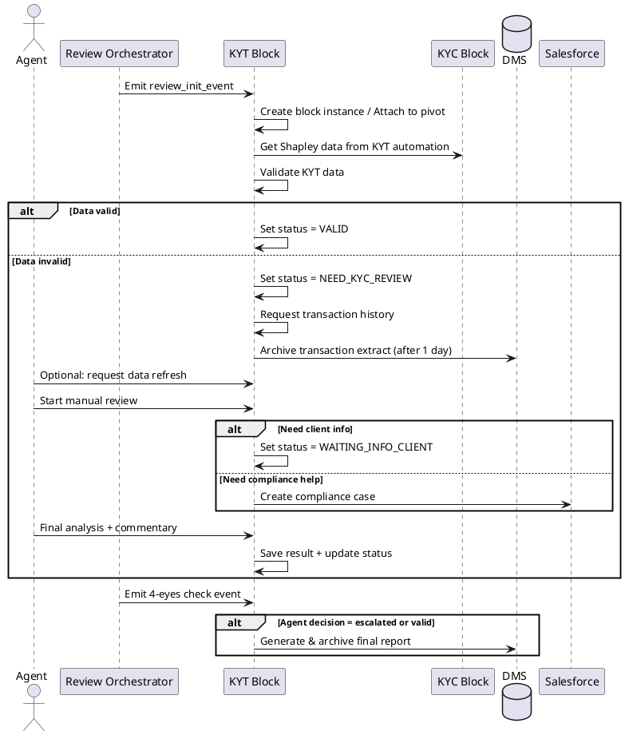
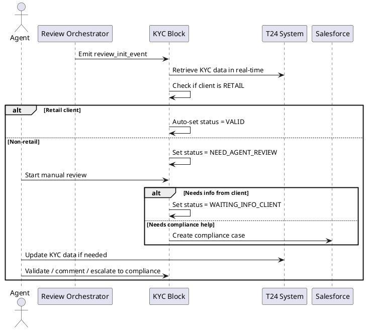
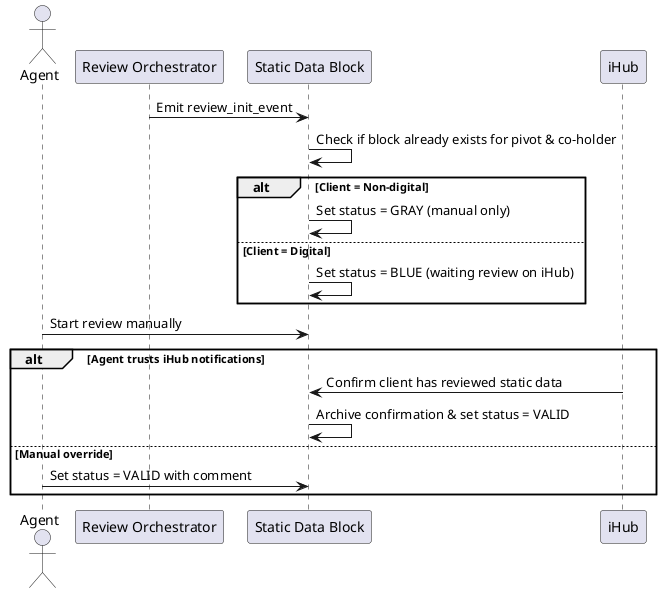

# test-app

# 360° Customer View - Initial Idea (KYC Remediation)

## Objective

Design a solution that provides a **360° view of a customer** within a **KYC remediation** context. The goal is to unify various internal and external data sources to:

* Holistically visualize a customer’s profile
* Accelerate and improve the reliability of KYC remediation processes
* Strengthen regulatory compliance (AML, FATF, GDPR, etc.)
* Support decision-making (risk-based approach)

## Initial Idea

### General Description

Automating customer remediation to obtain a 360° view of their KYC status.

Each customer (pivot) is associated with several distinct KYC blocks:

* **KYT (Know Your Transaction)**
* **Static Data**
* **Documents** (iHub or non-iHub)
* **Name Screening**
* **KYC (core identity review)**
* **Pivot Family**

---

## Block Behavior Summary (Orchestrated Flows)

### KYT Block - Sequence Summary

### KYC Block - Sequence Summary

### Static Data Block - Sequence Summary

### iHub Documents / Non-iHub Documents Block - Concepts

* Support manual review by agents
* Final decision only after 4-eyes or compliance review
* iHub notifications may inform the status
* Archive all versions of documents in DMS
* Escalation logic similar to Static or KYC blocks

---

## Next Steps

1. Integrate class diagrams for each block.
2. Define architecture levels (2 & 3).
3. Identify tech stack and APIs per flow.

---

*(Document editable through future iterations)*
