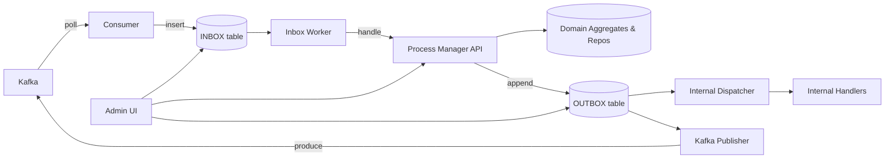
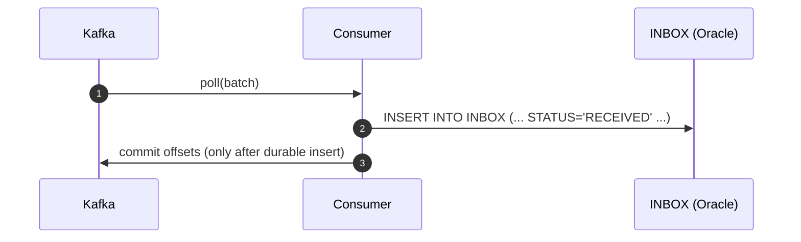
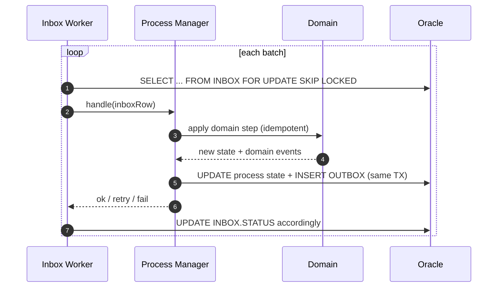
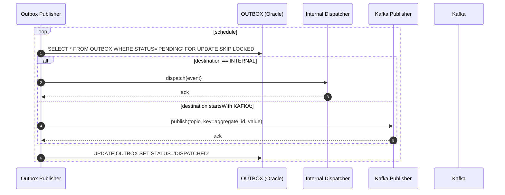
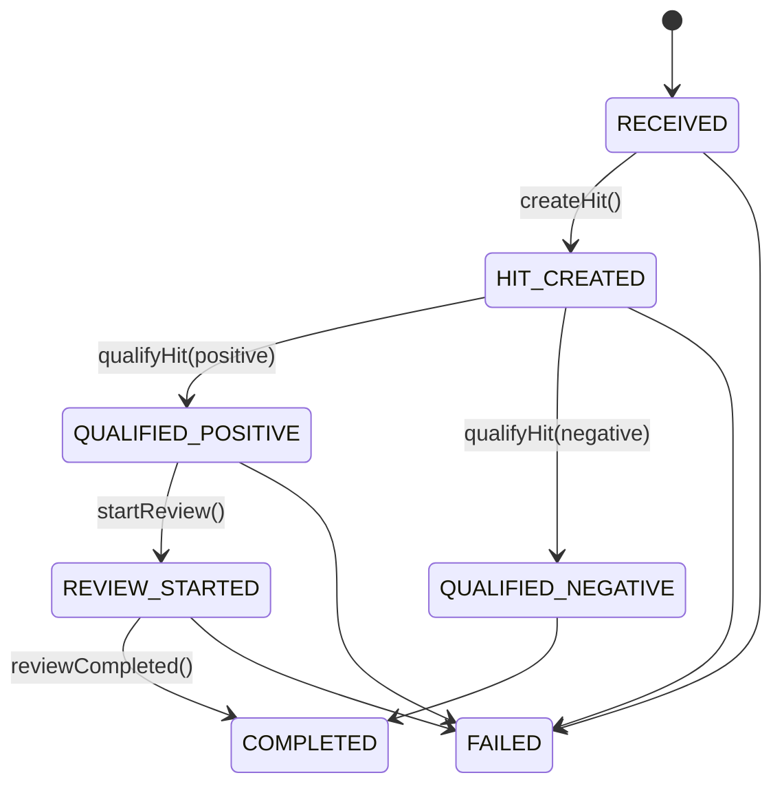
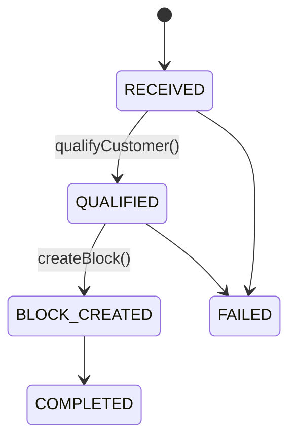

# DIPMO Pattern — Durable Inbox + Process Manager + Outbox

> **Target stack**: Java, Spring Modulith, Kafka, Oracle Database.  
> **Goal**: End‑to‑end resilience for event‑driven workflows with *exactly‑once effects*, ordered processing per aggregate, durable internal/external event publication, safe retries, and operational visibility.

---

## 1) Overview

**DIPMO** combines three proven ideas:

- **Durable Inbox** — Persist every Kafka message to a local table **before** any business side‑effects. This creates a safe buffer for replay, inspection, and backpressure.
- **Process Manager (per use‑case)** — A small orchestrator (finite state machine, FSM) that advances business state step by step (idempotent, versioned), invoking domain services.
- **Durable Outbox** — Persist every event you intend to publish (internally or back to Kafka) **in the same DB transaction** as the state change. Separate publishers dispatch from this table reliably.

**Why it’s resilient**
- Inputs (Kafka) and outputs (internal/Kafka events) are both **durably stored** → no loss, safe replay.  
- Orchestration lives in code and **state tables**, not volatile in‑memory events.  
- Clear policies for ordering, dedupe, retries, DLQ, and observability.

---

## 2) Architecture & Module Layout (Spring Modulith)



**Suggested modules**
```
com.yourco.kyc
└── onboarding / hits / review (feature slices)
    ├── domain/                 # aggregates, domain services
    ├── api/                    # use cases / process managers
    ├── inbox/                  # inbox entity + repo
    ├── inbound.messaging/      # Kafka consumers (store → commit)
    ├── processing/             # workers (inbox & outbox)
    ├── outbox/                 # outbox entity + repo + publishers
    └── admin/                  # operational endpoints/tools
```

**Modulith rules**
- `inbound.messaging` → depends only on `inbox`.  
- `processing` → depends on `inbox` + `api` (+ `outbox` for the publisher).  
- `api` → depends on `domain`.  
- `admin` → depends on `inbox`, `outbox`, `api`.  
- `domain` → no dependencies on infrastructure.

---

## 3) Oracle Data Model

> Oracle has no native `ENUM`. Use `VARCHAR2` + `CHECK`. Store JSON in **CLOB** with `IS JSON` constraint (or `JSON` type on 21c+).

### 3.1 INBOX
```sql
CREATE TABLE INBOX (
  ID                 NUMBER GENERATED BY DEFAULT AS IDENTITY PRIMARY KEY,
  MESSAGE_ID         VARCHAR2(200)      NOT NULL,
  SOURCE_SYSTEM      VARCHAR2(100)      NOT NULL,
  TOPIC              VARCHAR2(200)      NOT NULL,
  PARTITION_NUM      NUMBER(10)         NOT NULL,
  OFFSET_NUM         NUMBER(19)         NOT NULL,
  KEY_STR            VARCHAR2(4000),
  AGGREGATE_ID       VARCHAR2(200),
  EVENT_TYPE         VARCHAR2(200),
  PAYLOAD            CLOB               NOT NULL CHECK (PAYLOAD IS JSON),
  HEADERS            CLOB               NULL  CHECK (HEADERS IS JSON),
  EVENT_TS           TIMESTAMP WITH TIME ZONE,
  RECEIVED_AT        TIMESTAMP WITH TIME ZONE DEFAULT SYSTIMESTAMP NOT NULL,
  STATUS             VARCHAR2(20)       DEFAULT 'RECEIVED' NOT NULL,
  ATTEMPTS           NUMBER(10)         DEFAULT 0 NOT NULL,
  NEXT_ATTEMPT_AT    TIMESTAMP WITH TIME ZONE,
  PROCESSED_AT       TIMESTAMP WITH TIME ZONE,
  ERROR_CODE         VARCHAR2(200),
  ERROR_MESSAGE      VARCHAR2(2000),
  ERROR_STAGE        VARCHAR2(50),      -- e.g., CONSUMER_SERDE, BUSINESS
  RAW_PAYLOAD_BASE64 CLOB,
  CONSTRAINT UX_INBOX_DEDUPE UNIQUE (SOURCE_SYSTEM, MESSAGE_ID),
  CONSTRAINT CK_INBOX_STATUS CHECK (STATUS IN ('RECEIVED','RETRY','FAILED','PROCESSED','SERDE_ERROR'))
);

CREATE INDEX IX_INBOX_STATUS_DUE ON INBOX (STATUS, NEXT_ATTEMPT_AT);
CREATE INDEX IX_INBOX_RECEIVED_AT ON INBOX (RECEIVED_AT);
CREATE INDEX IX_INBOX_AGGREGATE  ON INBOX (AGGREGATE_ID);
```

### 3.2 OUTBOX
```sql
CREATE TABLE OUTBOX (
  ID              NUMBER GENERATED BY DEFAULT AS IDENTITY PRIMARY KEY,
  AGGREGATE_TYPE  VARCHAR2(50)   NOT NULL,
  AGGREGATE_ID    VARCHAR2(200)  NOT NULL,
  EVENT_TYPE      VARCHAR2(200)  NOT NULL,
  EVENT_VERSION   NUMBER(5)      DEFAULT 1 NOT NULL,
  PAYLOAD         CLOB           NOT NULL CHECK (PAYLOAD IS JSON),
  HEADERS         CLOB           NULL  CHECK (HEADERS IS JSON),
  DESTINATION     VARCHAR2(200)  NOT NULL,     -- INTERNAL or KAFKA:<topic>
  CREATED_AT      TIMESTAMP WITH TIME ZONE DEFAULT SYSTIMESTAMP NOT NULL,
  STATUS          VARCHAR2(20)   DEFAULT 'PENDING' NOT NULL,
  ATTEMPTS        NUMBER(10)     DEFAULT 0 NOT NULL,
  NEXT_ATTEMPT_AT TIMESTAMP WITH TIME ZONE,
  ERROR_CODE      VARCHAR2(200),
  ERROR_MESSAGE   VARCHAR2(2000),
  CONSTRAINT CK_OUTBOX_STATUS CHECK (STATUS IN ('PENDING','DISPATCHED','FAILED'))
);

CREATE INDEX IX_OUTBOX_PENDING ON OUTBOX (STATUS, NEXT_ATTEMPT_AT);
CREATE INDEX IX_OUTBOX_AGG     ON OUTBOX (AGGREGATE_TYPE, AGGREGATE_ID);
```

### 3.3 Process State (FSM)

#### HIT_PROCESS
```sql
CREATE TABLE HIT_PROCESS (
  ID               VARCHAR2(200) PRIMARY KEY,        -- correlation (message_id or business key)
  NOTIFICATION_ID  VARCHAR2(200) NOT NULL,           -- e.g., 126 iHub
  CUSTOMER_ID      VARCHAR2(200),
  STATE            VARCHAR2(30)  DEFAULT 'RECEIVED' NOT NULL,
  LAST_EVENT_TS    TIMESTAMP WITH TIME ZONE DEFAULT SYSTIMESTAMP NOT NULL,
  VERSION          NUMBER(10)    DEFAULT 0 NOT NULL,
  ERROR_CODE       VARCHAR2(200),
  ERROR_MESSAGE    VARCHAR2(2000),
  CONSTRAINT CK_HIT_STATE CHECK (STATE IN (
    'RECEIVED','HIT_CREATED','QUALIFIED_POSITIVE','QUALIFIED_NEGATIVE','REVIEW_STARTED','COMPLETED','FAILED'
  ))
);
```

#### ONBOARDING_PROCESS
```sql
CREATE TABLE ONBOARDING_PROCESS (
  ID               VARCHAR2(200) PRIMARY KEY,        -- onboardingId or aggregateId
  CUSTOMER_ID      VARCHAR2(200) NOT NULL,
  STATE            VARCHAR2(30)  DEFAULT 'RECEIVED' NOT NULL,
  LAST_EVENT_TS    TIMESTAMP WITH TIME ZONE DEFAULT SYSTIMESTAMP NOT NULL,
  VERSION          NUMBER(10)    DEFAULT 0 NOT NULL,
  ERROR_CODE       VARCHAR2(200),
  ERROR_MESSAGE    VARCHAR2(2000),
  CONSTRAINT CK_OB_STATE CHECK (STATE IN ('RECEIVED','QUALIFIED','BLOCK_CREATED','COMPLETED','FAILED'))
);
```

> For Oracle 21c+, consider the `JSON` data type instead of CLOB+`IS JSON`. Use monthly partitioning on `RECEIVED_AT` / `CREATED_AT` for retention and performance.

---

## 4) Sequence Diagrams / FSMs

### 4.1 Ingestion (Kafka → Inbox)


### 4.2 Processing (Inbox → PM → Outbox)


### 4.3 Durable Internal/External Event Dispatch


### 4.4 FSM — Notification 126 iHub → Hit → Review


### 4.5 FSM — Onboarding → Qualify → Block


---

## 5) Key Implementation Notes (Spring)

### 5.1 Kafka consumer (store → commit) with SERDE capture
- Use `ErrorHandlingDeserializer` to surface deserialization errors.  
- On SERDE errors, insert an INBOX row with `STATUS='SERDE_ERROR'`, keep the **raw bytes base64** in `RAW_PAYLOAD_BASE64`, mark `ERROR_STAGE='CONSUMER_SERDE'`, then commit offsets.

```java
props.put(ConsumerConfig.ENABLE_AUTO_COMMIT_CONFIG, false);
props.put(ConsumerConfig.KEY_DESERIALIZER_CLASS_CONFIG, ErrorHandlingDeserializer.class);
props.put(ConsumerConfig.VALUE_DESERIALIZER_CLASS_CONFIG, ErrorHandlingDeserializer.class);
props.put(ErrorHandlingDeserializer.KEY_DESERIALIZER_CLASS, StringDeserializer.class);
props.put(ErrorHandlingDeserializer.VALUE_DESERIALIZER_CLASS, StringDeserializer.class);
```

### 5.2 Inbox worker
- Read with `FOR UPDATE SKIP LOCKED`, small batches, exponential backoff, capped retries → `FAILED` + optional DLQ.
- Map inbox rows to **commands**, route to the corresponding **Process Manager** by topic / event type.

### 5.3 Process Managers (transactional)
- Each transition: update process row (optimistic lock on `VERSION`) **and** append to OUTBOX in **the same transaction**.
- Domain writes are **idempotent** (natural key upserts / optimistic version checks).  
- Reject stale versions, and either **park** or **skip** out‑of‑order items depending on the policy.

### 5.4 Outbox publisher(s)
- Two routes: `INTERNAL` (Modulith handlers) and `KAFKA:<topic>` (external).  
- Idempotent producer to Kafka, partition key = `AGGREGATE_ID` when ordering matters.

### 5.5 Oracle/JPA specifics
- Prefer `@Lob` `String`/`char[]` for JSON CLOB fields; add `@Column(columnDefinition="CLOB CHECK (PAYLOAD IS JSON)")` if you generate DDL yourself.  
- For upserts, use `MERGE` statements via `@Query(nativeQuery = true)` or Hibernate `@SQLInsert` customization.  
- Tune fetch sizes and batch writes: `hibernate.jdbc.batch_size`, `order_inserts`, `order_updates`.

---

## 6) Idempotency, Ordering, Versioning
- **Dedupe**: `UNIQUE(SOURCE_SYSTEM, MESSAGE_ID)` in INBOX.
- **Ordering**: require producers to key by `AGGREGATE_ID`. Optionally serialize workers per aggregate, or rely on version checks to drop stale items.
- **Versioning**: state rows increment `VERSION` on each successful transition; compare against `event.version` to detect gaps.

---

## 7) Error Handling & DLQ Policy
- **SERDE**: persist as `SERDE_ERROR` in INBOX; optionally mirror to a Kafka DLQ.
- **Transient** (timeouts, deadlocks): set `STATUS='RETRY'`, schedule with jittered backoff.
- **Permanent** (validation): set `STATUS='FAILED'` with `ERROR_CODE`, `ERROR_MESSAGE`.
- **Outbox failures**: same logic; nothing is lost while `STATUS='PENDING'`.

---

## 8) Observability & Ops
**Metrics**
- INBOX: depth, max age, %retry, %failed, consumer lag.  
- OUTBOX: pending depth, dispatch latency, %failed.  
- PM: transition latency, counts per state.

**Runbook**
1. Large backlog → scale workers; check hot partitions / aggregate hotspots.  
2. SERDE spike → schema drift → roll forward/back.  
3. Transition failures → hotfix; **targeted retries** from Admin UI.  
4. Replays/bulk retries with rate limits and safety checks.

**Retention**
- TTL on `PROCESSED` rows (INBOX/OUTBOX), monthly partitions, archival.

---

## 9) Worked Examples

### 9.1 Notification 126 (iHub) → Hit → Review
- **Consumer** writes INBOX rows (topic `notification-126`).  
- **Inbox Worker** calls `HitProcessManager.handle(...)` → `createHit()` → `qualifyHit()`.  
- If **positive**, PM appends `ReviewStarted` to OUTBOX and creates Review aggregate.  
- **Internal dispatcher** delivers `HitQualified` / `ReviewStarted` to other modules; **Kafka publisher** emits if external systems subscribe.

### 9.2 Onboarding Customer → Qualify → Block
- **Consumer** writes INBOX rows (topic `onboarding-customer`).  
- PM transitions `RECEIVED→QUALIFIED→BLOCK_CREATED→COMPLETED`, appending `CustomerQualified` and `BlockCreated` to OUTBOX along the way.  
- Block creation can be synchronous or asynchronous; outbox guarantees durability either way.

---

## 10) Oracle SQL — Handy Queries
```sql
-- Next batch due (INBOX)
SELECT *
FROM INBOX
WHERE STATUS IN ('RECEIVED','RETRY')
  AND (NEXT_ATTEMPT_AT IS NULL OR NEXT_ATTEMPT_AT <= SYSTIMESTAMP)
ORDER BY RECEIVED_AT
FETCH FIRST 100 ROWS ONLY
FOR UPDATE SKIP LOCKED;
```

```sql
-- Ageing report
SELECT STATUS, COUNT(*) AS CNT, MIN(RECEIVED_AT) AS OLDEST
FROM INBOX
GROUP BY STATUS;
```

```sql
-- OUTBOX pending
SELECT *
FROM OUTBOX
WHERE STATUS = 'PENDING'
  AND (NEXT_ATTEMPT_AT IS NULL OR NEXT_ATTEMPT_AT <= SYSTIMESTAMP)
ORDER BY CREATED_AT
FETCH FIRST 200 ROWS ONLY
FOR UPDATE SKIP LOCKED;
```

> On Oracle < 12c, replace `FETCH FIRST n ROWS ONLY` with `AND ROWNUM <= n` (with caveats for ordering).

---

## 11) Go‑Live Checklist
- [ ] Consumers: **insert → commit**; SERDE captured to INBOX.  
- [ ] Inbox Worker: `FOR UPDATE SKIP LOCKED`, backoff + DLQ.  
- [ ] Process Managers per use‑case with FSM + optimistic versioning.  
- [ ] Outbox durable + dual publishers (internal / Kafka).  
- [ ] Idempotent domain operations (natural keys / version checks).  
- [ ] Dashboards + alerts (depth, lag, retries, failures).  
- [ ] TTL + partitioning + archival.

