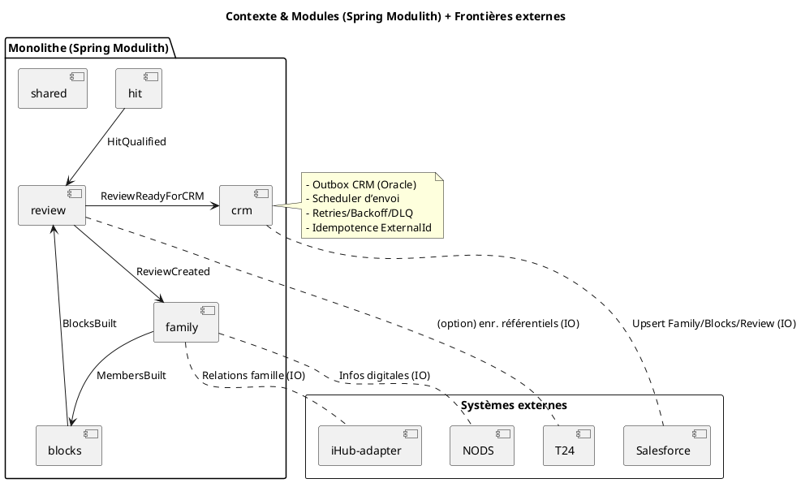
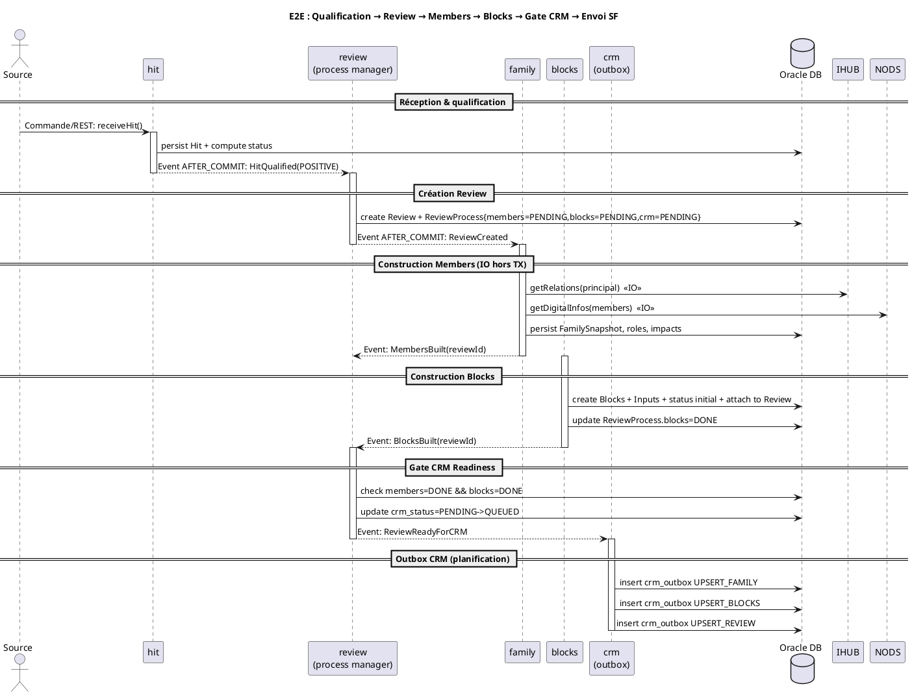
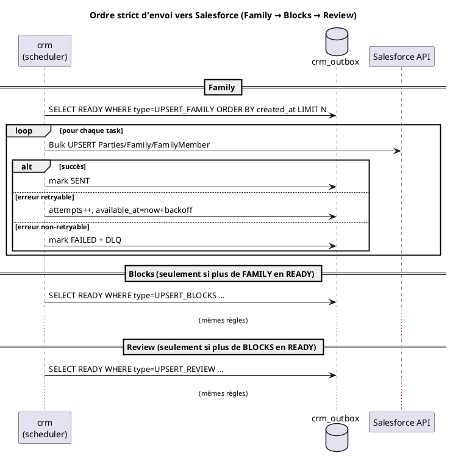
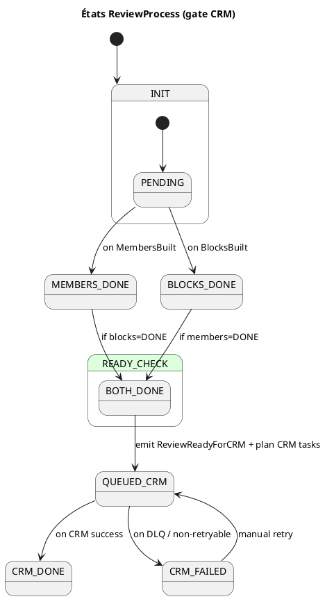
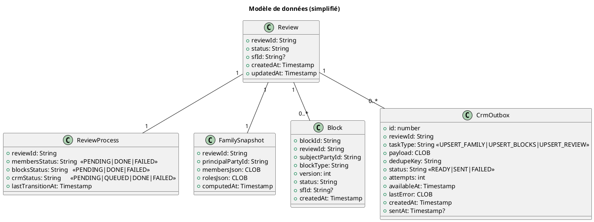
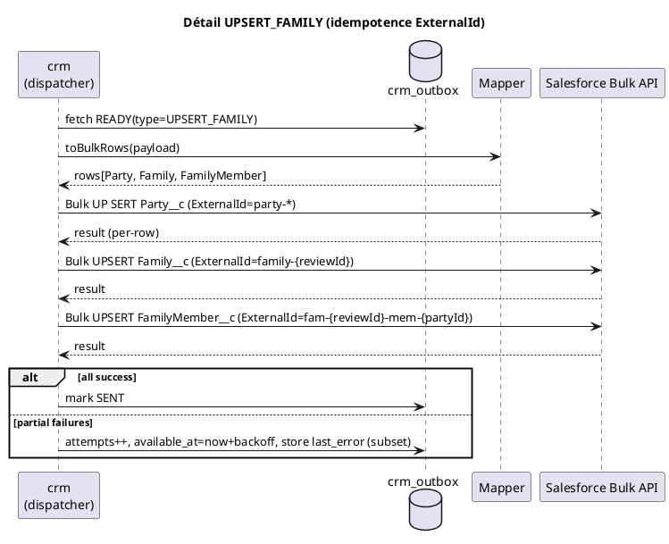

Voici un **blueprint** prêt à l’emploi (FR) avec **diagrammes PlantUML** pour ton intégration **Spring Modulith → Salesforce** en 3 phases (**Family → Blocks → Review**), incluant modules, événements, états, séquences et modèle de données.

---

# Blueprint d’intégration Salesforce (Spring Modulith)

## Objectifs

* Orchestration interne par **événements applicatifs** (AFTER_COMMIT).
* **Aucune IO externe** dans une transaction DB.
* **Outbox CRM** pour envoyer vers Salesforce en 3 étapes ordonnées et idempotentes.
* Reprise avec **retries**, **backoff** et **DLQ**.

## Modules (suggestion)

* `hit` (qualification de hit)
* `review` (agrégat + process manager “readiness”)
* `family` (construction famille)
* `blocks` (construction des blocs)
* `crm` (outbox + dispatcher Salesforce)
* `shared` (types d’événements, IDs, utilitaires)

## Événements (payloads minces)

* `HitQualified(hitId, status)`
* `ReviewCreated(reviewId, hitId)`
* `MembersBuilt(reviewId)`
* `BlocksBuilt(reviewId)`
* `ReviewReadyForCRM(reviewId)`

## Tables clés (Oracle — extrait)

* `review(review_id, status, created_at, updated_at, sf_id NULL)`
* `review_process(review_id PK, members_status, blocks_status, crm_status, last_transition_at)`
* `family_snapshot(review_id PK, principal_party_id, members_json, roles_json, computed_at)`
* `block(block_id PK, review_id, subject_party_id, block_type, version, status, created_at, updated_at, sf_id NULL)`
* `crm_outbox(id, review_id, task_type, payload, dedupe_key UNIQUE, status, attempts, available_at, last_error, created_at, sent_at)`

---

## Diagrammes PlantUML

### 1) Contexte & modules (composants)

### 2) Flux bout-à-bout (événements internes + gate CRM)

### 3) Séquence d’envoi Salesforce (ordonnancement outbox)

### 4) États du `ReviewProcess` (gate “CRM readiness”)

### 5) Modèle de données (classes essentielles)

### 6) Séquence détaillée “UPSERT_FAMILY” (avec idempotence)

---

## Bonnes pratiques (résumé)

* **AFTER_COMMIT** pour tous les listeners Modulith.
* Aucune dépendance externe dans une **TX DB** (IO après commit).
* **Outbox CRM** pour toute écriture Salesforce (ordonnée, idempotente).
* **ExternalId** déterministes : `party-{partyId}`, `family-{reviewId}`, `block-{blockId}`, `review-{reviewId}`.
* **Retries** exponentiels + **DLQ** pour erreurs non-retryables.
* **Observabilité** : `trace_id`, métriques backlog outbox, temps E2E Hit→CRM.

---

Si tu veux, je peux te générer ensuite les **squelettes Java** (entités JPA, listeners, services outbox, scheduler) en suivant exactement ces diagrammes.
