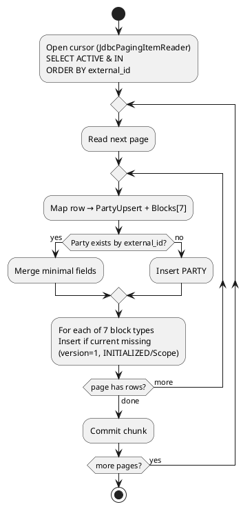
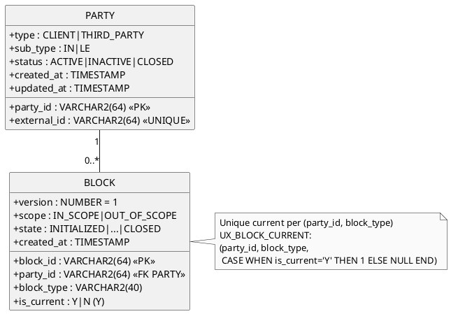
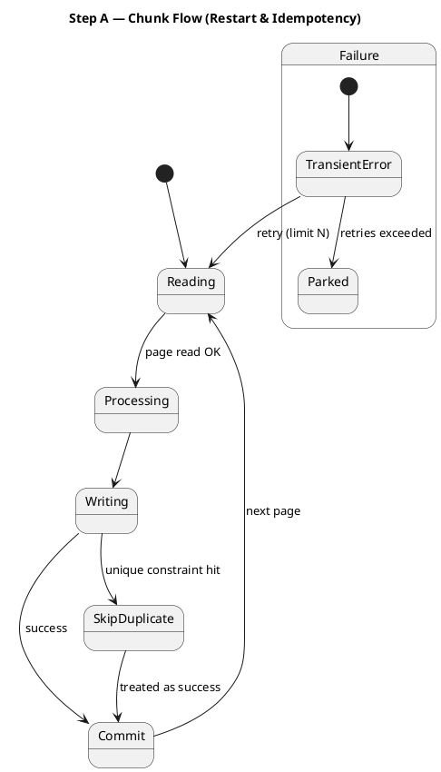
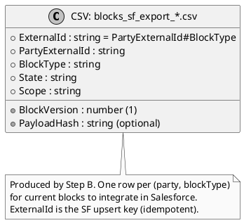

# Init Load Blueprint — Batch Party→Blocks & Salesforce CSV (v1)

**Goal**: One‑shot initial load (no scope filter) that reads **active natural persons** from a source DB, computes the **7 blocks** per party, writes into the **target KYC DB** (PARTY + BLOCK), then **exports a CSV** listing blocks to integrate later into Salesforce. **Idempotent** and **restartable**.

---

## 1) Architecture (high‑level)
```
        [Source DB] (dsSrc)
          PARTY_SRC (ACTIVE, IN/person)
                │  JDBC Paging Reader
                ▼
   Step A — Load Parties & Create Blocks (chunk)
   ┌─────────────────────────────────────────────────────────┐
   │ Reader (JDBC) → Processor (enrich 7 blocks) → Writer   │
   │ (upsert PARTY)         (defaults/status per role)       │
   │ (create 7 BLOCK rows, idempotent)                      │
   └─────────────────────────────────────────────────────────┘
                │
                ▼
   Step B — Export Salesforce CSV (chunk or writer-only)
   ┌─────────────────────────────────────────────────────────┐
   │ Reader (KYC DB query: blocks needing projection)       │
   │ → Writer (CSV file with ExternalId, Version, Hash, …)  │
   └─────────────────────────────────────────────────────────┘
```
**Notes**
- No events/listeners; direct **repo/JDBC** access.
- Two datasources: `dsSrc` (read‑only), `dsKyc` (write).
- Spring Batch **restartable**: job repository persists checkpoints.

---

## 2) Step A — Load Parties & Create Blocks
### 2.1 Reader (JDBC, dsSrc)
- **Type**: `JdbcPagingItemReader` (stateful, restartable), `saveState=true`.
- **Filter**: *active* **AND** *natural person* (IN). Example SQL (tune to source):
```sql
SELECT p.external_id, p.type, p.sub_type, p.status,
       p.full_name, p.birth_date, p.nationality, p.residency,
       p.email, p.phone
FROM PARTY_SRC p
WHERE p.status = 'ACTIVE' AND p.sub_type = 'IN'
ORDER BY p.external_id
```
- **Page size / fetch size**: configurable (e.g., 500/1000).
- **Key**: `external_id` (stable ordering for restart).

### 2.2 Processor (enrich → PartyUpsert + BlocksSnapshot)
- **Inputs**: Party row.
- **Outputs**: `PartyUpsert {partyId, type, subType, status, ...}` + `BlocksSnapshot[7]` (one per block type) with:
  - `blockType`, `scope` (IN_SCOPE/OUT_OF_SCOPE per role), `state` (INITIALIZED by default), `requiredTasks`, `payloadHash` (optionnel), `version=1`.
- **Business defaults** (v1):
  - For **CLIENT/IN**: 7 blocks → `INITIALIZED`.
  - For **THIRD_PARTY**: only relevant blocks `INITIALIZED`, others `OUT_OF_SCOPE` (configurable).

### 2.3 Writer (dsKyc) — idempotent
- **Upsert PARTY**: by `external_id` (natural key). If exists, update minimal fields; otherwise insert.
- **Create 7 BLOCKS** **only if absents**:
  - Constraint: at most **one current** per `(party_id, block_type)`.
  - On retry/restart, inserts that hit unique constraints are **treated as success** (no duplicate rows).
- **No historization** in init load (always `version=1`, `is_current='Y'`). Historization appears later during normal lifecycle.

---

## 3) Step B — Export Salesforce CSV
- **Goal**: produce a CSV file listing blocks to integrate into SF (one SF record per `(party, blockType)`).
- **Reader (dsKyc)**: query blocks needing integration, e.g. all newly created in Step A or `sf_version < version`.
```sql
SELECT b.party_id, b.block_type, b.version,
       b.state, b.scope,
       p.external_id AS party_external_id
FROM BLOCK b
JOIN PARTY p ON p.party_id = b.party_id
WHERE b.is_current = 'Y'
```
- **Writer**: `FlatFileItemWriter` (append=false) → one file per job execution.
- **File naming**: `blocks_sf_export_yyyyMMdd_HHmmss_JOBEXECID.csv` in configured folder.

### 3.1 CSV Schema (headers)
```
ExternalId,PartyExternalId,BlockType,BlockVersion,State,Scope,PayloadHash
```
Where:
- `ExternalId = PartyExternalId + '#' + BlockType` (idempotent SF upsert key)
- `PayloadHash` optional (if snapshot serialised), else blank.

---

## 4) Idempotency & Constraints (target KYC DB)
- **PARTY**:
  - `external_id` **UNIQUE**.
  - Upsert writer uses `external_id` to avoid duplicates; **retry safe**.
- **BLOCK**:
  - Unique current per `(party_id, block_type)` via filtered unique index (or check on `is_current='Y'`).
  - Initial load always writes `version=1`, `is_current='Y'`. On retry, insert conflicts are **skipped** and counted as success.
- **Export**:
  - File is new each run; if rerun, you can regenerate safely (consumer side should be idempotent via ExternalId).

---

## 5) Restartability & Retry (Spring Batch)
- **Chunk‑oriented** steps; each chunk runs in a transaction.
- **Reader stateful** (`saveState=true`): on restart, resumes at last committed page/key.
- **Fault tolerance**:
  - `retryLimit`: e.g., 3 on transient DB/network exceptions.
  - `skip(DataIntegrityViolationException.class)`: treat unique‑constraint collisions as idempotent success.
- **Job parameters** (optional): `chunkSize`, `fetchSize`, `exportDir`.
- **JobRepository** stores execution context, allowing `--spring.batch.job.name=initLoad` re‑launch to continue.

---

## 6) Data Model (target) — minimal for init load
**PARTY**
- `party_id (PK)`, `external_id (UNIQUE)`, `type (CLIENT|THIRD_PARTY)`, `sub_type (IN|LE)`, `status (ACTIVE|INACTIVE|CLOSED)`, timestamps.

**BLOCK**
- `block_id (PK)`, `party_id (FK PARTY)`, `block_type`, `version=1`, `is_current='Y'`, `scope`, `state`, timestamps.
- **Unique current**: `(party_id, block_type, CASE WHEN is_current='Y' THEN 1 END)`.

---

## 7) Operational Runbook
- **Profile**: `initload` (only repos/components needed for batch are active).
- **Props**:
  - `initload.chunk=500`, `initload.fetch=1000`, `initload.exportDir=/data/exports`.
  - `spring.batch.job.name=initLoad`.
- **Execution**:
```
java -jar app.jar \
  --spring.profiles.active=initload \
  --spring.batch.job.name=initLoad
```
- **Monitoring**: count rows processed/inserted, skipped (duplicates), CSV lines written; job exit status.

---

## 8) Open Points
- Exact mapping of source columns → target fields (name/format of IDs).
- Whether to serialise a `PayloadSnapshot` to compute `PayloadHash` (optional in init load).
- Whether Step B should filter only records from the current job run or **all current blocks** (prefer the latter for full refresh).

---

**End of Blueprint (v1)**


## 9) PlantUML Diagrams

> Copy-paste these in any PlantUML renderer. They reflect the blueprint’s high-level flow, batch steps, ER model, restartability, and the SF CSV contract.

### 9.1 High‑Level Architecture
```plantuml
@startuml
skinparam monochrome true
skinparam componentStyle rectangle

rectangle "Source DB (dsSrc)" as SRC {
  database "PARTY_SRC
(ACTIVE, IN)" as PARTY_SRC
}

package "KYC App (profile=initload)" as APP {
  component "Spring Batch Job: initLoad" as JOB
  rectangle "Step A
Load Parties & Create Blocks" as STEP_A
  rectangle "Step B
Export SF CSV" as STEP_B
}

database "KYC DB (dsKyc)" as KYC {
  database "PARTY" as PARTY
  database "BLOCK" as BLOCK
}

folder "Filesystem" as FS {
  file "blocks_sf_export_*.csv" as CSV
}

PARTY_SRC -down-> STEP_A : JDBC Paging Reader
STEP_A -down-> PARTY : upsert (idempotent)
STEP_A -down-> BLOCK : create 7 blocks (v=1, current)
STEP_A --> STEP_B : continuation
STEP_B -down-> CSV : FlatFileItemWriter

@enduml
```

### 9.2 Batch Job — Activity (Step A)


### 9.3 ER Diagram (Target KYC)


### 9.4 Restartability & Idempotency (Chunk lifecycle)


### 9.5 Salesforce CSV Contract


**End of Blueprint (v1)**


## 10) Exceptions, Retry & Restart Policy (détaillé)

### 10.1 Taxonomie d’exceptions
| Catégorie | Exemples (Spring/Java) | Étape(s) concernée(s) | Politique |
|---|---|---|---|
| **Transitoires infra** | `SQLTransientConnectionException`, `CannotGetJdbcConnectionException`, `DeadlockLoserDataAccessException`, `CannotAcquireLockException`, `QueryTimeoutException`, `SocketTimeoutException` | Reader/Writer | **Retry** avec backoff exponentiel (jusqu’à `retryLimit`), puis **FAIL** du step si épuisé |
| **Conflit d’unicité (idempotence)** | `DataIntegrityViolationException` (UNIQUE `external_id`, UX_BLOCK_CURRENT) | Writer | **Skip** (compte comme succès idempotent), trace `reason=IDEMPOTENT_DUPLICATE` |
| **Validation/métier** | `ConstraintViolationException` (Bean Validation), `IllegalArgumentException`, `DomainValidationException` (custom) | Processor/Writer | **Skip** (vers un fichier/flux d’erreurs), compteur + alerte Ops |
| **Parsing/mapping** | `FlatFileParseException`, `ConversionFailedException` | Reader/Processor | **Skip** la ligne, log avec `lineNumber` |
| **I/O fichier** | `IOException` (CSV), `AccessDeniedException` | Export CSV | **Retry** (limité); si persistant → **FAIL** step |
| **Inconnues (bug)** | autres Runtime | Toutes | **FAIL** immédiat (pas de skip) pour éviter les corruptions |

> Les **conflits d’unicité** sont attendus en **re-run** : on les **skip** systématiquement (idempotence). Les **erreurs transitoires** doivent être rejouées.

### 10.2 Configuration Step A (Load & Create)
- `chunkSize`: 500 (paramétrable)
- `retryLimit`: 3 (transitoires infra + I/O)
- `backoff`: exponentiel (1s → 2s → 4s, max 30s)
- `skip(DataIntegrityViolationException)`: `skipLimit=100000` (traiter comme succès idempotent)
- `skip(FlatFileParseException|ConstraintViolationException)`: `skipLimit=1000` (collecter dans error CSV)
- **Transaction**: 1 transaction **par chunk** ; en cas d’échec, **rollback du chunk** et re‑lecture des mêmes items.

### 10.3 Configuration Step B (Export CSV)
- Writer `FlatFileItemWriter` avec :
  - `append=false`, `shouldDeleteIfExists=true`, `shouldDeleteIfEmpty=true`
  - stratégie atomique : écrire dans `*.tmp` puis **rename** vers le nom final (via `FileExistsMode.REPLACE` ou custom `StepExecutionListener`)
- `retry(IOException)` avec backoff, `retryLimit=3` ; **FAIL** si persistant (pour éviter un fichier partiel non maîtrisé).

### 10.4 Listeners & journalisation
- `ItemReadListener/ProcessListener/WriteListener` → logs structurés (`jobId`, `stepId`, `chunk`, `partyExternalId`).
- `SkipListener` → écrit les **skips** dans `initload_errors_YYYYMMDD_HHmmss.csv` (ExternalId, cause).
- `RetryListener` → métriques (`retries.count`, `backoff.total`).
- `StepExecutionListener` → `beforeStep` crée les writers (CSV final & error), `afterStep` ferme proprement.
- `JobExecutionListener` → log récapitulatif (lignes lues/écrites/skippées, durée), + proposition de **commande de restart**.

### 10.5 Re-démarrage (restart) Spring Batch
- **JobRepository** conserve le **contexte d’exécution** (curseur du `JdbcPagingItemReader`, index de page, dernier `external_id`).
- **Restart** = relancer **le même JobInstance** (mêmes **JobParameters**) après un `FAILED` :
  - Spring Batch reprendra **là où le dernier chunk a été committé**.
  - Le Reader doit être `saveState=true` et **ordonné** par une clé **stable** (`external_id`).
- **Rerun complet** = nouvel **Instance** (ajouter un param différent, ex. `run.id=` ou date) : l’upsert et l’unicité rendent l’opération **idempotente**.

#### Commandes utiles
- **Exécution initiale** :
```
java -jar app.jar \
  --spring.profiles.active=initload \
  --spring.batch.job.name=initLoad \
  run.id=1
```
- **Restart après échec** (mêmes JobParameters, pas besoin de `run.id`) :
```
java -jar app.jar \
  --spring.profiles.active=initload \
  --spring.batch.job.name=initLoad
```
- **Rerun complet** (nouvelle instance) :
```
java -jar app.jar \
  --spring.profiles.active=initload \
  --spring.batch.job.name=initLoad \
  run.id=2
```
- **Via `JobOperator`** (admin) : `jobOperator.restart(executionId)`

### 10.6 Idempotence renforcée
- **PARTY** : `external_id UNIQUE` + upsert; en re-run → **no‑op**.
- **BLOCK** : unique “current” `(party_id, block_type)` ; création **si absent uniquement** (writer teste l’existence avant insert) ; collision unique → **skip** comptabilisé **mais OK**.
- **Export CSV** : SF est idempotent via `ExternalId` (`partyExternalId#blockType`). Régénérer le CSV ne pose pas de problème côté SF si l’ingestion gère l’upsert.

### 10.7 Gouvernance des seuils
- `skipLimit` trop petit ⇒ job **FAILED** prématurément ; valeur recommandée large pour les duplicates, plus stricte pour les erreurs de données.
- `retryLimit` + `backoff` à calibrer selon la SLO (ex. 1+2+4s = 7s max/erreur).

---

## 11) Annexes — Snippets de config (Spring Batch)

```java
new StepBuilder("import.parties", jobs)
  .<SrcPartyRow, PartyUpsert>chunk(props.chunk(), tx)
  .reader(jdbcPagingReader())
  .processor(processor())
  .writer(writer())
  .faultTolerant()
  .retry(SQLTransientException.class)
  .retry(CannotAcquireLockException.class)
  .retry(SocketTimeoutException.class)
  .retryLimit(props.retryLimit())
  .backOffPolicy(exponentialBackoff(1000, 2.0, 30000))
  .skip(DataIntegrityViolationException.class)
  .skip(FlatFileParseException.class)
  .skip(ConstraintViolationException.class)
  .skipLimit(props.skipLimit())
  .listener(skipListener)
  .listener(retryListener)
  .build();
```

```java
@Bean BackOffPolicy exponentialBackoff(long initialMs, double multiplier, long maxMs) {
  var p = new org.springframework.retry.backoff.ExponentialBackOffPolicy();
  p.setInitialInterval(initialMs);
  p.setMultiplier(multiplier);
  p.setMaxInterval(maxMs);
  return p;
}
```

---

### 11.1 Contrôles de cohérence avant/pendant exécution
- Vérifier que les **index d’unicité** existent (PARTY.external_id, UX_BLOCK_CURRENT) avant de lancer le job.
- Surveiller les **compteurs**: `read.count`, `write.count`, `skip.count`, `duplicate.skipped.count`, `retry.count`.
- Exporter un **error CSV** pour les skips non‑idempotents (validation/parsing) avec la cause.

---

## 12) PlantUML — Flow de restart (complément)
```plantuml
@startuml
skinparam monochrome true
start
:Job initLoad start;
partition StepA {
  :Read + Process + Write (chunk);
  if (Transient error?) then (yes)
    :Retry with backoff (<= limit);
    if (Still failing?) then (yes)
      :Step FAILED; Job FAILED;
      stop
    else (no)
      :Continue;
    endif
  else (no)
    :Commit chunk; Next page;
  endif
}

== Restart ==
:start with same JobParameters;
:Reader resumes from last committed page/key;
:Reprocess remaining items; Skip duplicates;
:Job COMPLETED;
stop
@enduml
```

**End of Blueprint (v1)**

