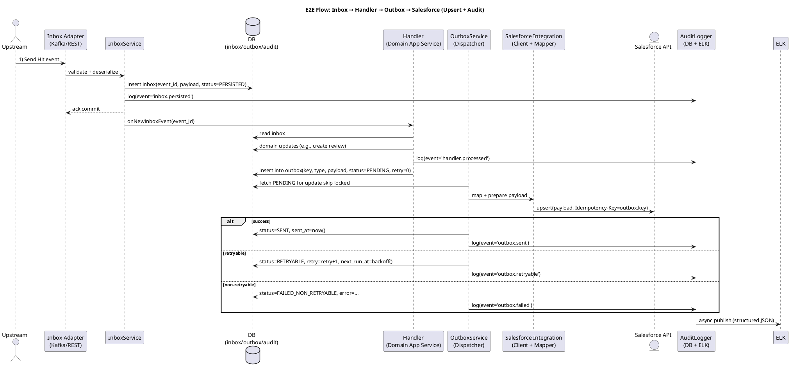
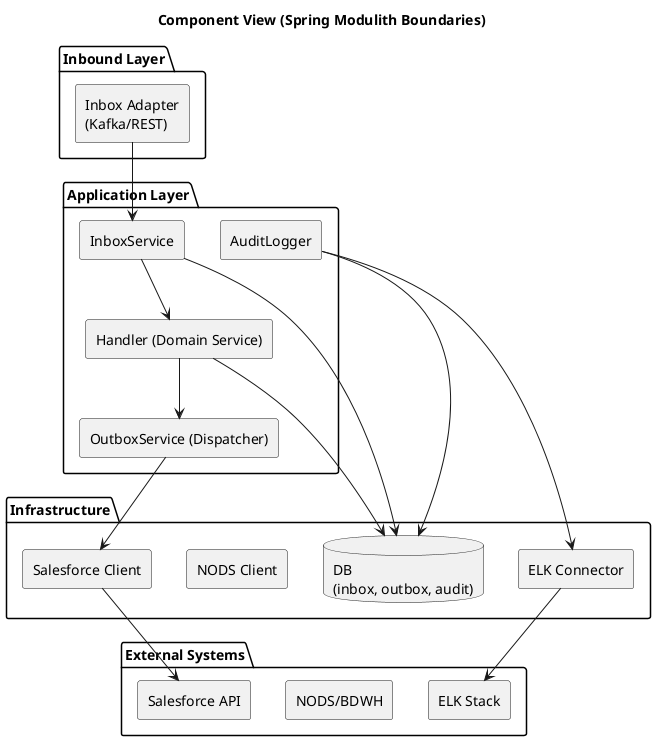
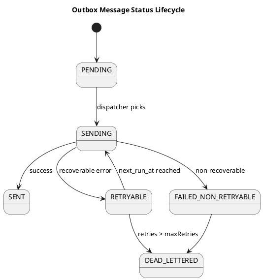

# 🧱 Blueprint — Inbox to Salesforce Integration Flow (v1.2)

> **Audience:** Developers & Technical Leads  
> **Purpose:** Provide a technical reference and modular breakdown for implementing the Inbox → Handler → Outbox → Salesforce flow using **Spring Modulith** patterns, with a **separate Audit Trail feature**.  
> **Context:** KYC Remediation project — transactional and asynchronous event-driven orchestration.

---

## 🗓 Versioning
- **Version:** v1.2 (clarifies separation of *Handler*, *Outbox*, and *Audit Trail* stories)  
- **Date:** 2025-10-06  
- **Changes vs v1.1:** Explicitly separates Handler and Outbox responsibilities; Audit Trail confirmed as its own feature; adds per‑story anchors & details for better Jira linking.

---

## 🎯 Objective  
Define structure, boundaries, and design of the **Inbox → Handler → Outbox → Salesforce** chain.  
Guarantee reliable event processing, full auditability, and parallel development with clear ownership.

---

## 📊 Story Summary

| **Story Name** | **Purpose / Description** | **Key Responsibilities** | **Dependencies** |
|----------------|---------------------------|---------------------------|------------------|
| **Inbox Story** | Receive upstream events and persist them transactionally before business logic starts. | - Deserialize & validate incoming event - Persist to `inbox` table - Idempotency & retryable statuses - Commit ack after persistence | None |
| **Handler Story** | Execute domain-specific business logic in response to persisted events; emit internal domain events. | - Load event from Inbox - Business rules & enrichment - Domain state changes (e.g., review creation) - Emit **internal domain event** (`@DomainEvents`) | Inbox |
| **Outbox Story** | Implement **transactional outbox** to guarantee reliable delivery to external systems. | - Persist outbound messages to `outbox` - Status machine & dedup - Dispatcher with backoff & retry - Idempotency key management | Handler |
| **Salesforce Integration Story** | Map and send outbox messages to Salesforce (upsert), with enrichment if needed. | - Build payloads - Fetch enrichment from NODS/BDWH - Call Salesforce API (Upsert) - Handle errors/retries & map responses | Outbox |
| **Audit Trail Story** | Centralized audit logging across the chain (DB + ELK), as a **separate cross‑cutting feature**. | - Post‑commit structured audit logs - Persist to `audit_log` table - Async publish to ELK - Correlate via `trace_id` | Inbox, Handler, Outbox, Salesforce |
| **E2E Test Story** | Validate full flow and audit consistency. | - Simulate inbound event - Assert Inbox → Handler → Outbox → Salesforce - Verify audit entries across steps - Provide reproducible reference test | All above |

> Tip: In Jira, create one Epic “Inbox→Salesforce Integration” and child stories matching the table above. Link each story to the relevant section anchors below.

---

## 🧠 Design Overview

### Sequence — Inbox → Handler → Outbox → Salesforce (with Audit Trail)

---

### Component View — Module Boundaries

---

### Outbox Message Status Lifecycle

---

## 🧾 Table Definitions

### Inbox Table
| **Column** | **Type** | **Description** |
|-------------|-----------|----------------|
| `id` | UUID | Unique record identifier |
| `event_type` | VARCHAR(100) | Event class/type |
| `payload` | JSONB | Serialized event data |
| `status` | VARCHAR(30) | PENDING / PROCESSED / FAILED |
| `retry_count` | INT | Number of processing retries |
| `trace_id` | VARCHAR(255) | Correlation ID |
| `error_message` | TEXT | Last known error |
| `created_at` | TIMESTAMP | Creation time |
| `updated_at` | TIMESTAMP | Last update time |

### Outbox Table
| **Column** | **Type** | **Description** |
|-------------|-----------|----------------|
| `id` | UUID | Unique identifier |
| `type` | VARCHAR(100) | Event type |
| `payload` | JSONB | Serialized outbound message |
| `target_system` | VARCHAR(50) | e.g., “SALESFORCE” |
| `status` | VARCHAR(30) | PENDING / SENT / FAILED / RETRYABLE |
| `key` | VARCHAR(255) | Idempotency key (hash of source + type + businessId) |
| `retry_count` | INT | Retry attempts |
| `next_run_at` | TIMESTAMP | Next retry time |
| `sent_at` | TIMESTAMP | Sent timestamp |
| `trace_id` | VARCHAR(255) | Correlation ID |
| `error_message` | TEXT | Error details |

### Audit Table
| **Column** | **Type** | **Description** |
|-------------|-----------|----------------|
| `id` | UUID | Unique identifier |
| `trace_id` | VARCHAR(255) | Correlation ID |
| `entity` | VARCHAR(100) | e.g., inbox, handler, outbox, integration |
| `action` | VARCHAR(100) | e.g., persisted, processed, sent, failed |
| `status` | VARCHAR(50) | SUCCESS / FAILURE |
| `payload` | JSONB | Context snapshot |
| `timestamp` | TIMESTAMP | Log timestamp |
| `error` | TEXT | Optional error message |

---

## 🔗 Story Details & Anchors (for Jira)

### Inbox Story
**Goal:** Transactionally receive and persist incoming events.  
**Blueprint refs:** [Sequence](#sequence), [Inbox Table](#inbox-table).  
**Acceptance (excerpt):** Persist to `inbox`, idempotency, `inbox.persisted` audit.

### Handler Story
**Goal:** Apply domain rules and emit internal domain events.  
**Blueprint refs:** [Sequence](#sequence), [Component View](#component-view).  
**Acceptance (excerpt):** Domain updates, emit `@DomainEvents`, `handler.processed` audit.

### Outbox Story
**Goal:** Transactional outbox with dispatcher, retries, and idempotency.  
**Blueprint refs:** [Sequence](#sequence), [Outbox State](#outbox-state), [Outbox Table](#outbox-table).  
**Acceptance (excerpt):** Create outbox record, dispatcher/backoff, status machine, audit on send/fail.

### Salesforce Integration Story
**Goal:** Map & upsert to Salesforce, handling errors and enrichment.  
**Blueprint refs:** [Sequence](#sequence), [Component View](#component-view).  
**Acceptance (excerpt):** Proper payload, enrichment, SENT/RETRYABLE/FAILED handling, idempotency key.

### Audit Trail Story
**Goal:** Post‑commit structured audit logging to DB + ELK.  
**Blueprint refs:** [Sequence](#sequence), [Audit Table](#audit-table), [Component View](#component-view).  
**Acceptance (excerpt):** Audit record per step with `trace_id`; async ELK publish; minimal perf impact.

### E2E Test Story
**Goal:** Validate full chain and audit consistency.  
**Blueprint refs:** [Sequence](#sequence).  
**Acceptance (excerpt):** Golden path + retryable and non‑retryable scenarios; ELK trace by `trace_id`.

---

## ✅ Deliverables

- Inbox, Handler, Outbox, Salesforce, **Audit** modules implemented  
- Transactional guarantees (Inbox/Outbox) and idempotency keys in place  
- Audit events persisted in DB and exported to ELK  
- E2E test verifying full functional chain and audit visibility

---

**Author:** Architecture Team  
**Version:** v1.2  
**Date:** 2025-10-06  
