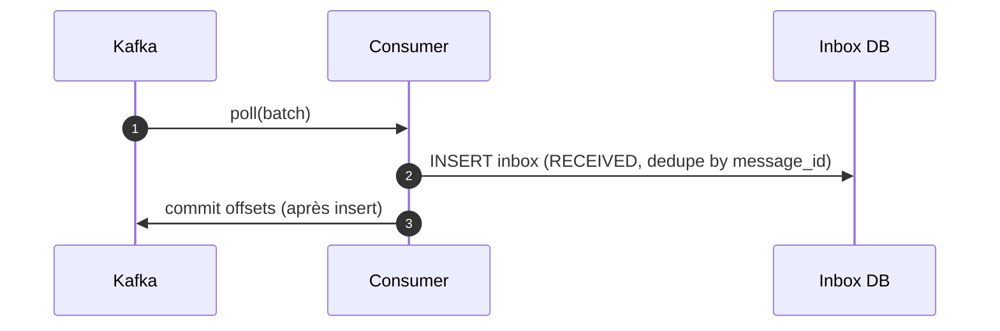
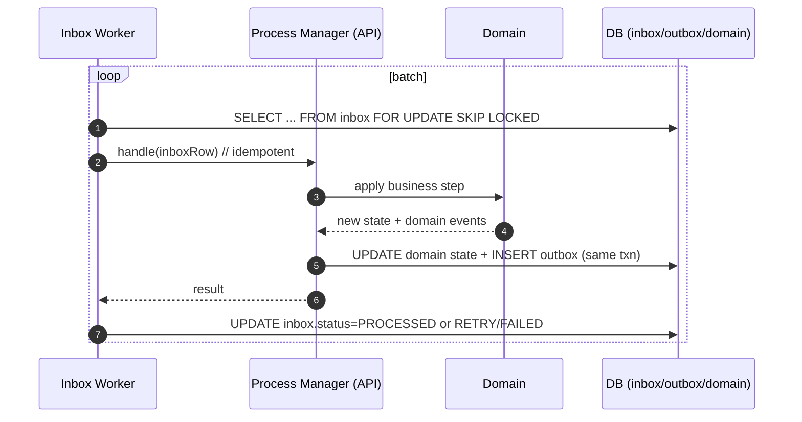
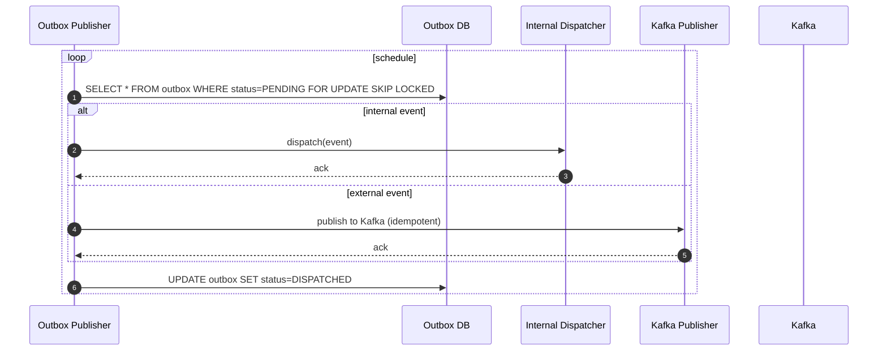
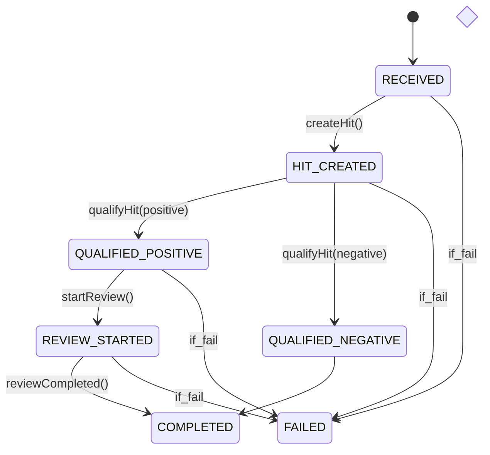
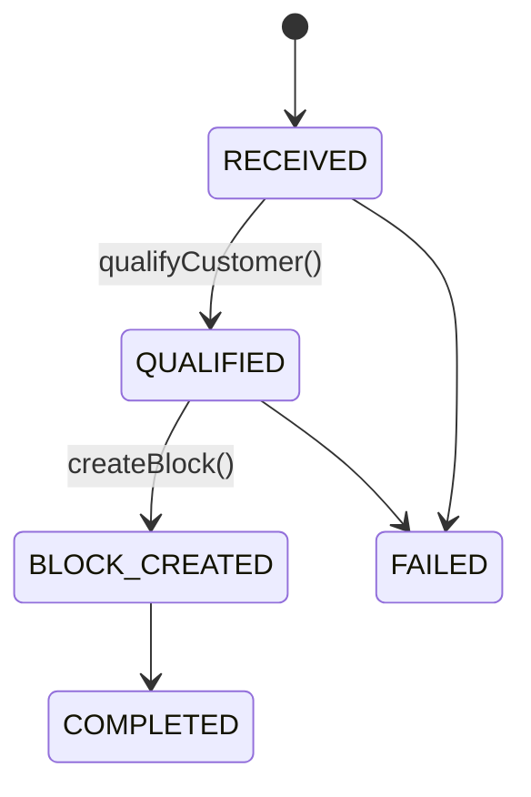

# Kafka Inbox + Process Manager + Outbox (DIPMO) — Resilient Design for Spring Modulith (Java)

> **Goal**: une solution **hautement résiliente** couvrant *tous* les cas d’erreur pour des traitements métier sur événements Kafka, avec **exactly-once effects**, **rejeu contrôlé**, **ordonnancement par agrégat**, et **publication d’événements internes/externes** de manière **durable**. Basée 100% open source, Java + Spring Modulith.

> **Pattern name**: **DIPMO** = **D**urable **I**nbox + **P**rocess **M**anager + **O**utbox.

---

> **Scope**: Robust ingest of Kafka events with **exactly-once effects** on the local service (database, downstream calls), **idempotency**, **retries**, and **operational runbook**. Optimized for JVM (Spring) and Rust stacks using open‑source components only.

---

## 1) Vue d’ensemble du pattern DIPMO

- **Inbox (durable)** : tout message Kafka reçu est **persisté** dans `inbox` avant tout effet métier → on peut *toujours* rejouer, diagnostiquer, mettre en pause.
- **Process Manager (Saga fine-grained)** : un **orchestrateur par cas d’usage** (ex. *HitProcess*, *OnboardingProcess*) pilote l’enchaînement des étapes et les **transitions d’état**. Les effets côté domaine sont **idempotents** et **versionnés**.
- **Outbox (durable)** : tout événement **interne ou externe** émis par le domaine est écrit en `outbox` *dans la même transaction* que la mise à jour de l’état. Deux routeurs de sortie :
  - **Internal Dispatcher** : lit `outbox` et **publie** l’événement aux **handlers internes** (Spring Modulith) de façon **persistante** (pas de perte).
  - **Kafka Publisher** : lit `outbox` et **publie** vers Kafka (idempotent producer + clé d’agrégat).

**Pourquoi ça résout “tous les cas” ?**
- Les **entrées** (Kafka) et les **sorties** (events internes/externes) sont **persistées** avant traitement/émission → aucune perte.
- Le **Process Manager** tient l’**état métier** (FSM), tolère les duplicats, contrôle l’ordre par `aggregate_id` et applique des **politiques de retry/DLQ** claires.
- On peut **inspecter** `inbox`, `outbox` et les **tables de processus**, rejouer proprement, et isoler les *poison messages*.

---

## 2) Architecture

```mermaid
flowchart LR
  K[Kafka] -->|poll| C[Consumer]
  C -->|insert| INBOX[(inbox)]
  INBOX --> W[Inbox Worker]
  W -->|call| PM[Process Manager API]
  PM --> D[(Domain Aggregates & Repos)]
  PM -->|append| OUTBOX[(outbox)]
  OUTBOX --> INTD[Internal Dispatcher]
  OUTBOX --> KP[Kafka Publisher]
  INTD --> H1[Internal Handler(s)]
  KP -->|produce| K
  ADM[Admin UI] --> INBOX
  ADM --> OUTBOX
  ADM --> PM
```

**Modules (Spring Modulith)**
- `inbound.messaging` : consumers Kafka (store → commit)
- `inbox` : table + repo + DAO
- `processing` : workers (lecture inbox, lecture outbox)
- `domain` : agrégats (Hit, Review, Customer, Block…) + règles
- `api` : cas d’usage (Process Managers)
- `outbox` : table + repo + publishers (internal/kafka)
- `admin` : endpoints d’observabilité & replays

---

## 3) Séquences clés

### 3.1 Ingestion (Kafka → Inbox)


### 3.2 Traitement (Inbox → Process Manager → Outbox)


### 3.3 Diffusion durable des événements


---

## 4) Modèle de données (Oracle)

> Oracle n’a pas de `ENUM`. On utilise des **VARCHAR2** avec **CHECK constraints** (ou tables de référence). JSON est stocké en **CLOB** (avec contrainte `IS JSON`) ou en type **JSON** si Oracle ≥ 21c.

### 4.1 `INBOX`
```sql
CREATE TABLE INBOX (
  ID                 NUMBER GENERATED BY DEFAULT AS IDENTITY PRIMARY KEY,
  MESSAGE_ID         VARCHAR2(200)      NOT NULL,
  SOURCE_SYSTEM      VARCHAR2(100)      NOT NULL,
  TOPIC              VARCHAR2(200)      NOT NULL,
  PARTITION_NUM      NUMBER(10)         NOT NULL,
  OFFSET_NUM         NUMBER(19)         NOT NULL,
  KEY_STR            VARCHAR2(4000),
  AGGREGATE_ID       VARCHAR2(200),
  EVENT_TYPE         VARCHAR2(200),
  PAYLOAD            CLOB               NOT NULL CHECK (PAYLOAD IS JSON),
  HEADERS            CLOB               NULL  CHECK (HEADERS IS JSON),
  EVENT_TS           TIMESTAMP WITH TIME ZONE,
  RECEIVED_AT        TIMESTAMP WITH TIME ZONE DEFAULT SYSTIMESTAMP NOT NULL,
  STATUS             VARCHAR2(20)       DEFAULT 'RECEIVED' NOT NULL,
  ATTEMPTS           NUMBER(10)         DEFAULT 0 NOT NULL,
  NEXT_ATTEMPT_AT    TIMESTAMP WITH TIME ZONE,
  PROCESSED_AT       TIMESTAMP WITH TIME ZONE,
  ERROR_CODE         VARCHAR2(200),
  ERROR_MESSAGE      VARCHAR2(2000),
  ERROR_STAGE        VARCHAR2(50),
  RAW_PAYLOAD_BASE64 CLOB,
  CONSTRAINT UX_INBOX_DEDUPE UNIQUE (SOURCE_SYSTEM, MESSAGE_ID),
  CONSTRAINT CK_INBOX_STATUS CHECK (STATUS IN ('RECEIVED','RETRY','FAILED','PROCESSED','SERDE_ERROR'))
);

-- Indexes conseillés
CREATE INDEX IX_INBOX_STATUS_DUE ON INBOX (STATUS, NEXT_ATTEMPT_AT);
CREATE INDEX IX_INBOX_RECEIVED_AT ON INBOX (RECEIVED_AT);
CREATE INDEX IX_INBOX_AGGREGATE ON INBOX (AGGREGATE_ID);
```

### 4.2 `OUTBOX`
```sql
CREATE TABLE OUTBOX (
  ID              NUMBER GENERATED BY DEFAULT AS IDENTITY PRIMARY KEY,
  AGGREGATE_TYPE  VARCHAR2(50)   NOT NULL,
  AGGREGATE_ID    VARCHAR2(200)  NOT NULL,
  EVENT_TYPE      VARCHAR2(200)  NOT NULL,
  EVENT_VERSION   NUMBER(5)      DEFAULT 1 NOT NULL,
  PAYLOAD         CLOB           NOT NULL CHECK (PAYLOAD IS JSON),
  HEADERS         CLOB           NULL  CHECK (HEADERS IS JSON),
  DESTINATION     VARCHAR2(200)  NOT NULL,      -- INTERNAL ou KAFKA:<topic>
  CREATED_AT      TIMESTAMP WITH TIME ZONE DEFAULT SYSTIMESTAMP NOT NULL,
  STATUS          VARCHAR2(20)   DEFAULT 'PENDING' NOT NULL,
  ATTEMPTS        NUMBER(10)     DEFAULT 0 NOT NULL,
  NEXT_ATTEMPT_AT TIMESTAMP WITH TIME ZONE,
  ERROR_CODE      VARCHAR2(200),
  ERROR_MESSAGE   VARCHAR2(2000),
  CONSTRAINT CK_OUTBOX_STATUS CHECK (STATUS IN ('PENDING','DISPATCHED','FAILED'))
);

CREATE INDEX IX_OUTBOX_PENDING ON OUTBOX (STATUS, NEXT_ATTEMPT_AT);
CREATE INDEX IX_OUTBOX_AGG ON OUTBOX (AGGREGATE_TYPE, AGGREGATE_ID);
```

### 4.3 Tables de processus (FSM)

#### `HIT_PROCESS`
```sql
CREATE TABLE HIT_PROCESS (
  ID               VARCHAR2(200) PRIMARY KEY,     -- corrélé à message_id ou business key
  NOTIFICATION_ID  VARCHAR2(200) NOT NULL,        -- ex: 126 ihub
  CUSTOMER_ID      VARCHAR2(200),
  STATE            VARCHAR2(30)  DEFAULT 'RECEIVED' NOT NULL,
  LAST_EVENT_TS    TIMESTAMP WITH TIME ZONE DEFAULT SYSTIMESTAMP NOT NULL,
  VERSION          NUMBER(10)    DEFAULT 0 NOT NULL,
  ERROR_CODE       VARCHAR2(200),
  ERROR_MESSAGE    VARCHAR2(2000),
  CONSTRAINT CK_HIT_STATE CHECK (STATE IN (
    'RECEIVED','HIT_CREATED','QUALIFIED_POSITIVE','QUALIFIED_NEGATIVE','REVIEW_STARTED','COMPLETED','FAILED'
  ))
);
```

#### `ONBOARDING_PROCESS`
```sql
CREATE TABLE ONBOARDING_PROCESS (
  ID               VARCHAR2(200) PRIMARY KEY,     -- from aggregate_id or onboardingId
  CUSTOMER_ID      VARCHAR2(200) NOT NULL,
  STATE            VARCHAR2(30)  DEFAULT 'RECEIVED' NOT NULL,
  LAST_EVENT_TS    TIMESTAMP WITH TIME ZONE DEFAULT SYSTIMESTAMP NOT NULL,
  VERSION          NUMBER(10)    DEFAULT 0 NOT NULL,
  ERROR_CODE       VARCHAR2(200),
  ERROR_MESSAGE    VARCHAR2(2000),
  CONSTRAINT CK_OB_STATE CHECK (STATE IN ('RECEIVED','QUALIFIED','BLOCK_CREATED','COMPLETED','FAILED'))
);
```

**Notes Oracle**
- Pour JSON natif (Oracle ≥ 21c), remplacer `CLOB` + `IS JSON` par le type `JSON`.
- Pas d’index partiels → utiliser des **index composites** (ex. `(STATUS, NEXT_ATTEMPT_AT)`).
- Partitionnement conseillé (mois) sur `RECEIVED_AT`/`CREATED_AT` pour purge & perfs.

---


## 5) Consumers & Workers (réglages clés)

- **Consumer (inbound.messaging)** : `enable.auto.commit=false`, commit **après insert** dans `inbox`. `ErrorHandlingDeserializer` + `DefaultErrorHandler` qui **insère** en `inbox` les erreurs SERDE (flag `SERDE_ERROR`).
- **Inbox Worker** : `SELECT ... FOR UPDATE SKIP LOCKED` sur `RECEIVED/RETRY` (hors `SERDE_ERROR` par défaut). Backoff exponentiel + `maxAttempts` → `FAILED` + DLQ.
- **Outbox Publisher** : même approche (`FOR UPDATE SKIP LOCKED`), deux routeurs (internal/kafka), idempotent producer Kafka, clé = `aggregate_id`.
- **Ordering** :
  - **Kafka** : exiger la **clé = aggregate_id** côté producteurs.
  - **Workers** : optionnellement sérialiser par agrégat (un worker par clé) ou vérifier `version` pour **dropper** les messages obsolètes (`STALE`).

---

## 6) Idempotence, ordre, versions

- **Dédoublonnage** : index unique `(source_system, message_id)` sur `inbox`; natural keys + upserts côté domaine.
- **FSM** (Process Manager) : toute transition **vérifie la version** (`WHERE id=? AND version=?`) → `version=version+1` si succès, sinon **retry** (conflit ≈ ordre non respecté).
- **Anciennes versions** : si `event.version < state.version` → no-op (`PROCESSED/STALE`).
- **Sauts de versions** : soit **parquer** en `RETRY` en attendant, soit **continuer** si le domaine le permet (stratégie explicite).

---

## 7) Gestion d’erreurs & politique DLQ

- **SERDE (consumer)** : enregistrement en `inbox` (`SERDE_ERROR` + `raw_payload_base64`), optionnel **DLQ Kafka**.
- **Validation métier** : `FAILED` avec `error_code=VALIDATION`, `error_message`. Rejeu possible après correction.
- **Timeouts/transients** : `RETRY` + backoff, `attempts++`.
- **Poison** : au‑delà de `maxAttempts`, `FAILED` + DLQ.
- **Outbox** : mêmes règles (échecs de publication internes/externes). Rien n’est perdu tant que `outbox.status != DISPATCHED`.

---

## 8) Observabilité & runbook

**Metrics**
- `inbox.depth`, `inbox.max_age`, `%retry`, `%failed`, consumer lag.
- `outbox.depth`, `outbox.dispatch.latency`, `%failed`.
- `pm.transition.latency`, `pm.state` par agrégat.

**Dashboards** : vues par agrégat (`HIT`, `ONBOARDING`), par topic, et par étape.

**Runbook**
1. Backlog élevé → scaler workers Inbox/Outbox; vérifier partitions chaudes.
2. Pics de `SERDE_ERROR` → dérive de schéma → rollback/rollforward.
3. `FAILED` massif sur une transition → bug métier → **hotfix** puis **retry ciblé**.
4. Replays : via `admin` (sélection par intervalle/agrégat) avec **limites**.

---

## 9) Capacity (ordre de grandeur)

- Workers Inbox ≈ `(RPS_inbox × L_inbox_insert) / concurrency`.
- Workers Outbox ≈ `(RPS_events × L_publish) / concurrency`.
- Process Manager : dépend des **latences métier** (I/O vers Salesforce, etc.) → isoler via **timeouts** et **circuits**.

---

## 10) Sécurité & conformité

- Masquer/hasher les PII dans logs; chiffrage `payload` si nécessaire.
- TTL sur `PROCESSED` (inbox/outbox) + archivage.
- Traçabilité : conserver `partition+offset`, `message_id`, `aggregate_id`.

---

## 11) Implémentation ciblée — cas d’usage concrets

### 11.1 Cas 1 — *Notification 126 iHub* → **Hit** → **Review**

**Règle**: à la réception d’un événement *Notification126*, on **crée un Hit**, on **qualifie** (positive/negative). Si **positive** → démarrer un **Review**. On publie **HitCreated**, **HitQualified**, **ReviewStarted** comme **événements outbox** (internes et/ou Kafka selon besoin).



**Transitions (Process Manager `HitProcess`)**
- `RECEIVED → HIT_CREATED` :
  - Effets : `hitRepository.upsert(...)`, `outbox.append(HitCreated)`
- `HIT_CREATED → QUALIFIED_POSITIVE/NEGATIVE` :
  - Effets : `outbox.append(HitQualified{result})`
- `QUALIFIED_POSITIVE → REVIEW_STARTED` :
  - Effets : `reviewRepository.create(...)`, `outbox.append(ReviewStarted)`
- Chaque transition est **idempotente** (natural keys + version).

**Handlers**
- **Internal Dispatcher** livre `HitQualified` aux modules `review` et/ou `salesforce` (projection ou appels), durablement.
- **Kafka Publisher** envoie `HitQualified` si d’autres systèmes externes doivent consommer.

### 11.2 Cas 2 — *Onboarding Customer* → **Qualify** → **Block**



**Transitions (Process Manager `OnboardingProcess`)**
- `RECEIVED → QUALIFIED` : enrichissements, validations, scoring → `outbox.append(CustomerQualified)`
- `QUALIFIED → BLOCK_CREATED` : `blockRepository.create(...)`, `outbox.append(BlockCreated)`

**Remarques**
- Selon volumétrie, `createBlock()` peut être **synchrone** ou **asynchrone** (toujours via outbox).

---

## 12) Snippets clés (Spring)

### 12.1 Consumer + SERDE errors → inbox
```java
@Bean
public ConsumerFactory<String, String> cf() {
  var props = new HashMap<String, Object>();
  props.put(ConsumerConfig.ENABLE_AUTO_COMMIT_CONFIG, false);
  props.put(ConsumerConfig.KEY_DESERIALIZER_CLASS_CONFIG, ErrorHandlingDeserializer.class);
  props.put(ConsumerConfig.VALUE_DESERIALIZER_CLASS_CONFIG, ErrorHandlingDeserializer.class);
  props.put(ErrorHandlingDeserializer.KEY_DESERIALIZER_CLASS, StringDeserializer.class);
  props.put(ErrorHandlingDeserializer.VALUE_DESERIALIZER_CLASS, StringDeserializer.class);
  // + custom deserializer for JSON → if it fails, EHD wraps exception
  return new DefaultKafkaConsumerFactory<>(props);
}

@KafkaListener(topics = "notification-126", containerFactory = "manualAckBatchFactory")
public void onBatch(List<ConsumerRecord<String, String>> records, Acknowledgment ack) {
  for (var r : records) {
    tryInsertInbox(r); // normal path
  } catch (Exception e) {
    insertSerdeError(r, e); // status=SERDE_ERROR, raw_payload_base64
  }
  ack.acknowledge();
}
```

### 12.2 Inbox Worker → Process Manager
```java
@Service
class InboxWorker {
  @Scheduled(fixedDelayString = "${inbox.worker.delay:1000}")
  @Transactional
  public void tick() {
    var batch = repo.lockNextBatch(100);
    for (var row : batch) {
      try {
        processManager.handle(row); // route by topic/type → HitProcess / OnboardingProcess
        repo.markProcessed(row.id());
      } catch (TransientBusinessException ex) {
        repo.markRetry(row.id(), nextBackoff(row.attempts()));
      } catch (PermanentBusinessException ex) {
        repo.markFailed(row.id(), ex.code(), ex.getMessage());
        // optional: DLQ Kafka
      }
    }
  }
}
```

### 12.3 Process Manager (transaction unique : état + outbox)
```java
@Service
@RequiredArgsConstructor
public class HitProcessManager {
  private final HitProcRepo proc;
  private final HitRepo hits;
  private final OutboxRepo outbox;

  @Transactional
  public void handle(InboxRow row) {
    var cmd = mapToCommand(row); // idempotent mapping
    var p = proc.getOrCreate(cmd.processId());

    switch (p.state()) {
      case RECEIVED -> {
        hits.upsert(cmd.hitKey(), cmd.toHit());
        proc.transition(p, HIT_CREATED);
        outbox.append("HIT",""+cmd.hitId(), "HitCreated", cmd.asEvent());
      }
      case HIT_CREATED -> {
        var result = qualify(cmd);
        proc.transition(p, result.positive()? QUALIFIED_POSITIVE : QUALIFIED_NEGATIVE);
        outbox.append("HIT",""+cmd.hitId(), "HitQualified", result.asEvent());
        if (result.positive()) {
          startReview(cmd);
          proc.transition(p, REVIEW_STARTED);
          outbox.append("HIT",""+cmd.hitId(), "ReviewStarted", result.asEvent());
        } else {
          proc.transition(p, COMPLETED);
        }
      }
      // ... other states ...
    }
  }
}
```

### 12.4 Outbox Publisher (internal + Kafka)
```java
@Service
class OutboxPublisher {
  @Scheduled(fixedDelayString = "${outbox.publisher.delay:500}")
  @Transactional
  public void tick() {
    var events = outbox.lockNextPending(200);
    for (var e : events) {
      try {
        if (e.destination().startsWith("KAFKA:")) publishKafka(e);
        else dispatchInternal(e);
        outbox.markDispatched(e.id());
      } catch (Exception ex) {
        outbox.markRetry(e.id(), nextBackoff(e.attempts()));
      }
    }
  }
}
```

---

## 13) Évolution de schéma & contrats
- **Registry** (Avro/JSON Schema/Proto) en **compatibilité rétro**.
- `event_type` & `event_version` en headers + payload → routeurs stables.
- Validation à l’entrée (inbox) + à la sortie (outbox) pour éviter les surprises.

---

## 14) Checklist finale (résilience)
- [ ] Consumers batch, **insert → commit**
- [ ] Inbox worker avec **FOR UPDATE SKIP LOCKED**
- [ ] Process Managers par cas (Hit, Onboarding) avec **FSM + version**
- [ ] Outbox durable + publishers (internal/Kafka)
- [ ] Idempotence (natural keys, upserts, unique indexes)
- [ ] Backoff + DLQ clairs (inbox & outbox)
- [ ] Dashboards (inbox/outbox/pm) + runbook
- [ ] TTL + archivage

---

### Annexes
- **Comparatif** (Inline vs Inbox-Only vs DIPMO) – voir section *Trade-offs & Alternatives* précédente.


- Use **Schema Registry** (Avro/JSON Schema/Protobuf) with **backward compatible** evolution.
- Validate payloads at inbox write time; reject malformed with `FAILED` + DLQ.
- Include `event_type` & `version` in headers to route to correct handlers.

---

## 13) Admin & Replay Tools

- **List** pending/failed with filters (topic, type, aggregate, date).
- **Retry** single or bulk with safety checks (max batch, rate limit).
- **Skip** (force `PROCESSED`) only when domain allows.
- **Export** failed payloads for offline analysis.

---

## 14) Configuration Cheatsheet

- Kafka: `enable.auto.commit=false`, `max.poll.records=500`, `max.poll.interval.ms=600000`, `session.timeout.ms=45000`.
- Worker: `batchSize=100`, `maxAttempts=5`, backoff = `1m,5m,15m,1h,6h` + jitter.
- DB: connection pool sized to `consumers + workers × 2`.
- Housekeeping: archive/drop `PROCESSED` older than 90 days.

---

## 15) Trade-offs & Alternatives

- **Kafka Transactions (EOS)**: great for read-process-produce pipelines, less helpful for DB side-effects without inbox/outbox.
- **Process directly without inbox**: lowest latency but risks duplicates/missed events; acceptable only for pure read-only projections.
- **Stream processors (Flink/KStreams)**: built-in state & exactly-once, but still consider an **inbox table** if you need SQL/auditability and ops visibility.

---

## 16) Checklist (Go-Live Readiness)

- [ ] Dedupe unique index in place and tested
- [ ] End-to-end idempotency verified
- [ ] Retry/DLQ thresholds agreed with business
- [ ] Dashboards + alerts live
- [ ] Backpressure drill (pause/resume, scale workers)
- [ ] Runbook documented & on-call trained
- [ ] GDPR/PII handling reviewed

---

### Appendix A — Example Queries (Oracle)

```sql
-- Prochaine fournée à traiter (INBOX)
SELECT *
FROM INBOX
WHERE STATUS IN ('RECEIVED','RETRY')
  AND (NEXT_ATTEMPT_AT IS NULL OR NEXT_ATTEMPT_AT <= SYSTIMESTAMP)
ORDER BY RECEIVED_AT
FETCH FIRST 100 ROWS ONLY
FOR UPDATE SKIP LOCKED;
```

```sql
-- Rapport d'ancienneté (ageing)
SELECT STATUS, COUNT(*) AS CNT, MIN(RECEIVED_AT) AS OLDEST
FROM INBOX
GROUP BY STATUS;
```

```sql
-- OUTBOX : événements en attente
SELECT *
FROM OUTBOX
WHERE STATUS = 'PENDING'
  AND (NEXT_ATTEMPT_AT IS NULL OR NEXT_ATTEMPT_AT <= SYSTIMESTAMP)
ORDER BY CREATED_AT
FETCH FIRST 200 ROWS ONLY
FOR UPDATE SKIP LOCKED;
```

> Sur Oracle < 12c, remplace `FETCH FIRST n ROWS ONLY` par `AND ROWNUM <= n` (au prix d’un ORDER BY moins fiable).
