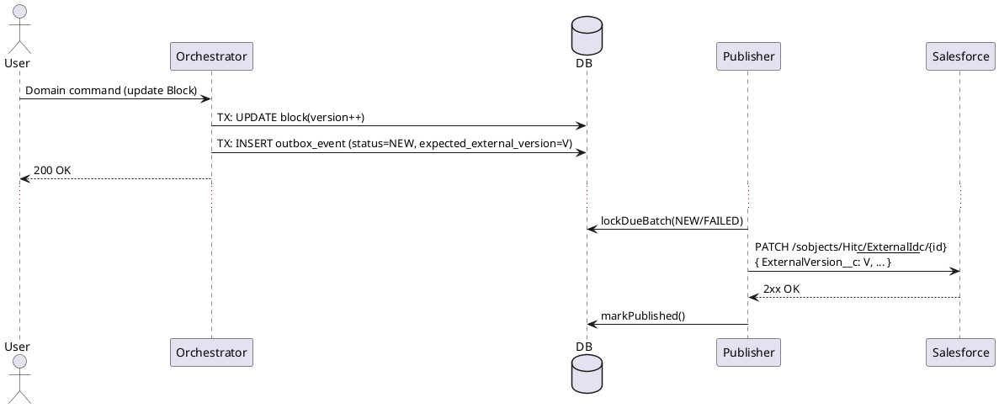
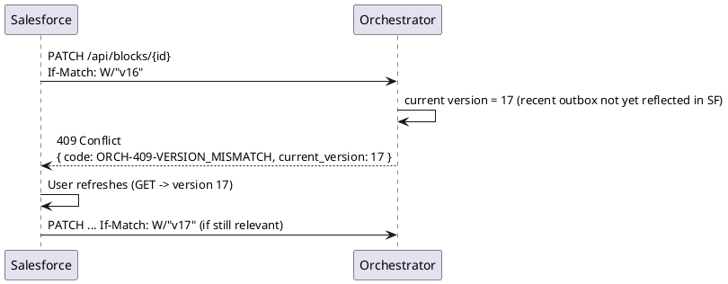

# KYC — Outbox for Salesforce (no Inbox)

> **Goal**: Document a minimal, robust **Outbox** pattern to publish Orchestrator updates to **Salesforce** over HTTP. Handle **desynchronization** via **version fencing** and clearly explain the two scenarios (success vs. conflict) with **PlantUML** diagrams. **No Inbox** flow and **no separate retry ledger**.

---

## 0) Outbox pattern — what it is and why it helps
**Definition.** The Outbox pattern persists an *integration message* in the **same database transaction** as the domain state change. A separate publisher later reads from this outbox and delivers the message to external systems.

**Why it’s valuable**
- **Atomicity**: domain write and message are committed together — no lost intent.
- **Resilience**: safe **crash recovery** and **network failure** handling; retries are DB‑driven.
- **Decoupling**: the domain is not blocked by slow/failed HTTP calls.
- **Idempotence**: external upserts (e.g., Salesforce `ExternalId__c`) allow safe re‑delivery.
- **Backpressure**: publisher can throttle or batch; consumer outages don’t break domain flows.
- **Ordering per aggregate**: optional FIFO using an aggregate sequence/version.
- **Auditability**: the outbox row is a durable, queryable trace of what was intended.
- **Compliance & security**: payload minimization, retention policies, and field encryption if needed.

> TL;DR — The outbox gives you **effectively‑once** delivery at the business level (at‑least‑once transport + idempotent consumer), with **operational control** and **automatic recovery**.

---

## 1) Assumptions & principles
- **Orchestrator is the system of record**.
- **Transactional outbox**: the integration intent is stored **within the same DB transaction** as the domain update.
- **Asynchronous publication** to Salesforce via a **single publisher** coordinated by **ShedLock**.
- **Idempotence** in Salesforce using **`ExternalId__c`** (upsert).
- **Version fencing** using **`ExternalVersion__c`** (mirrors the last Orchestrator version that SF knows).
- **Salesforce → Orchestrator patches are synchronous** with **optimistic concurrency** (`If‑Match`/version header). If versions differ ⇒ **HTTP 409 Conflict**.
- **No retry ledger**: `attempts` + `next_attempt_at` live on the outbox row.

---

## 2) Outbox model (minimal DDL)
```sql
CREATE TYPE outbox_status AS ENUM ('NEW','FAILED','PUBLISHED','PARKED','SUPERSEDED');

CREATE TABLE outbox_event (
  id                        UUID PRIMARY KEY,
  aggregate_type            VARCHAR(120) NOT NULL,
  aggregate_id              VARCHAR(120) NOT NULL,
  sequence                  BIGINT NULL,  -- aggregate version for FIFO per block
  event_type                VARCHAR(200) NOT NULL,
  payload                   JSONB NOT NULL,
  headers                   JSONB NULL,
  occurred_at               TIMESTAMP NOT NULL DEFAULT now(),
  aggregate_version         BIGINT NULL,
  expected_external_version BIGINT NULL,  -- fencing on SF side
  status                    outbox_status NOT NULL DEFAULT 'NEW',
  attempts                  INT NOT NULL DEFAULT 0,
  next_attempt_at           TIMESTAMP NULL,
  last_error                TEXT NULL,
  published_at              TIMESTAMP NULL
);
CREATE INDEX idx_outbox_due  ON outbox_event(status, next_attempt_at, occurred_at);
CREATE INDEX idx_outbox_fifo ON outbox_event(aggregate_type, aggregate_id, sequence);
```

---

## 3) Flow — emit & publish
**Emit (same TX as domain)**
```java
@ApplicationModuleListener
@Transactional
void on(BlockUpdated ev) {
  outbox.insertNew(new OutboxRecord(
    UUID.randomUUID(), "Block", ev.blockId(), ev.version(),
    "BlockUpdated", mapper.valueToTree(ev),
    Map.of("schemaVersion","v1","eventId", UUID.randomUUID().toString()),
    Instant.now(), ev.version(), /* expected_external_version */ ev.version()
  ));
}
```

**Publish (async, ShedLock)**
```java
@Scheduled(fixedDelayString = "${outbox.publisher.fixed-delay:1000}")
@SchedulerLock(name = "outbox-publisher-salesforce", lockAtLeastFor = "PT1S", lockAtMostFor = "PT30S")
@Transactional
void publishDue() {
  var batch = repo.lockDueBatch(100); // FOR UPDATE SKIP LOCKED + sort by agg/sequence
  for (var e : batch) {
    try {
      sf.upsertWithFence(e.aggregateId(), e.payload(), e.getExpectedExternalVersion());
      repo.markPublished(e.id());
    } catch (RateLimitedException rle) {
      repo.defer(e.id(), rle.retryAfter(), rle.getMessage());
    } catch (VersionConflictException vce) {
      repo.markSuperseded(e.id(), vce.getMessage());
    } catch (TransientException te) {
      repo.defer(e.id(), Instant.now().plus(retry.nextBackoff(e.attempts())), te.getMessage());
    } catch (PermanentException pe) {
      repo.markParked(e.id(), pe.getMessage());
    }
  }
}
```

**Salesforce client (minimal contract)**
```java
interface SalesforceClient {
  void upsertWithFence(String externalId, JsonNode payload, Long expectedExternalVersion)
    throws RateLimitedException, VersionConflictException, TransientException, PermanentException;
}
```
- `PATCH /sobjects/<Obj>__c/ExternalId__c/{externalId}` (idempotent upsert).
- Include `ExternalVersion__c = expectedExternalVersion`; a Flow/Apex validation **rejects** on mismatch.

---

## 4) Desync & version conflict
**Decision.** Salesforce → Orchestrator updates are **synchronous** and guarded by **optimistic concurrency**.
- While a local outbox is **pending** (NEW/FAILED), the **local version** is higher than SF’s `ExternalVersion__c` ⇒ any PATCH from SF using the **older** version must be **rejected with 409**.
- Users in SF should **refresh** to read the current version and **retry**, or **open a manual investigation** if needed.

**Behaviors**
- **Outbox pending**: local version > `ExternalVersion__c` ⇒ SF PATCH with stale `If‑Match` ⇒ **409 Conflict**.
- **Outbox published**: `ExternalVersion__c` is updated; SF can now PATCH with the correct version.

---

## 5) PlantUML diagrams (two scenarios)

### 5.1 Scenario A — Success (Outbox → SF publish)


### 5.2 Scenario B — Conflict (SF patch with stale version)


---

## 6) Retry/backoff policy (Outbox only)
```yaml
outbox:
  publisher:
    fixed-delay: 1000
    default:
      max-attempts: 10
      base-backoff-ms: 500
      max-backoff-ms: 60000
      jitter-pct: 0.2
```
> No separate retry history table: `attempts` + `next_attempt_at` are sufficient. Use `PARKED` for permanent errors; `SUPERSEDED` for obsolete updates.

---

## 7) Minimal observability
- **Metrics**: `outbox.publish.success`, `outbox.publish.failed`, `outbox.superseded.count`, `outbox.backlog.count`, `outbox.age.p95`.
- **Logs** (structured): `event_id`, `aggregate_id`, `attempts`, `next_attempt_at`, `error_code`, `traceId`.
- **Alerts**: backlog above threshold; any `PARKED` present.

---

## 8) TL;DR
- Write the **Outbox in the same transaction** as the domain update; publish **asynchronously** (ShedLock).
- **Idempotent** upsert to Salesforce using `ExternalId__c` and **version fencing** via `ExternalVersion__c`.
- **409 Conflict** for SF→RGO patches with stale versions while an outbox is still pending; no Inbox and no retry ledger.

