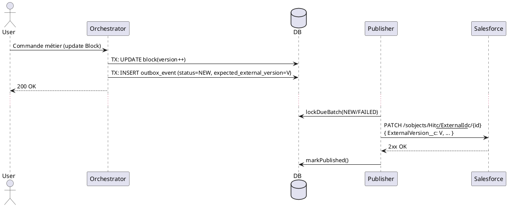
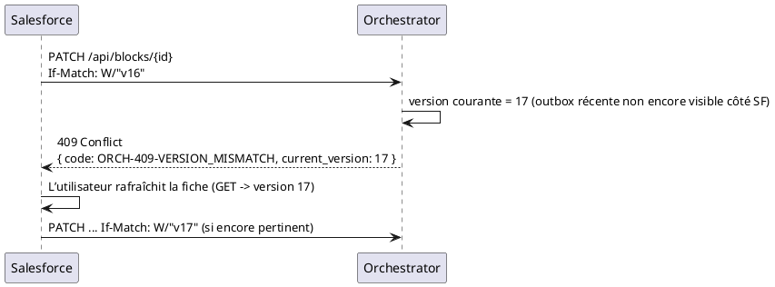

# KYC — Outbox Salesforce (sans Inbox)

> **Objectif** : documenter un pattern **Outbox** minimaliste pour pousser les mises à jour de l’Orchestrator vers **Salesforce**, gérer la **désynchronisation** par **contrôle de version**, et **expliquer les deux scénarios** (succès / conflit) avec des **schémas PlantUML**. **Pas d’Inbox**, pas de journal de retry séparé.

---

## 1) Hypothèses & principes
- **Orchestrator = maître** de la vérité métier.
- **Outbox transactionnelle** : l’intention d’intégration (événement d’intégration) est persistée **dans la même transaction** que la mise à jour du domaine.
- **Publication asynchrone** vers Salesforce (HTTP) via un **publisher** unique **ShedLock**.
- **Idempotence** côté Salesforce via **`ExternalId__c`** (upsert).
- **Fencing de version** : Salesforce maintient **`ExternalVersion__c`** qui reflète la dernière version Orchestrator **connue**. Les patchs **Salesforce → Orchestrator** sont **HTTP synchro** avec **`If-Match`** (ou `X-Orchestrator-Version`) ⇒ **409 Conflict** si la version fournie ≠ version courante locale.
- **Pas de “retry ledger”** dédié : la **table Outbox** porte `attempts` + `next_attempt_at`.

---

## 2) Modèle Outbox (DDL minimal)
```sql
CREATE TYPE outbox_status AS ENUM ('NEW','FAILED','PUBLISHED','PARKED','SUPERSEDED');

CREATE TABLE outbox_event (
  id                        UUID PRIMARY KEY,
  aggregate_type            VARCHAR(120) NOT NULL,
  aggregate_id              VARCHAR(120) NOT NULL,
  sequence                  BIGINT NULL,  -- version agrégat pour FIFO par bloc
  event_type                VARCHAR(200) NOT NULL,
  payload                   JSONB NOT NULL,
  headers                   JSONB NULL,
  occurred_at               TIMESTAMP NOT NULL DEFAULT now(),
  aggregate_version         BIGINT NULL,
  expected_external_version BIGINT NULL,  -- fencing côté SF
  status                    outbox_status NOT NULL DEFAULT 'NEW',
  attempts                  INT NOT NULL DEFAULT 0,
  next_attempt_at           TIMESTAMP NULL,
  last_error                TEXT NULL,
  published_at              TIMESTAMP NULL
);
CREATE INDEX idx_outbox_due ON outbox_event(status, next_attempt_at, occurred_at);
CREATE INDEX idx_outbox_fifo ON outbox_event(aggregate_type, aggregate_id, sequence);
```

---

## 3) Flux — émission & publication
**Émission (dans la même TX que le domaine)**
```java
@ApplicationModuleListener
@Transactional
void on(BlockUpdated ev) {
  outbox.insertNew(new OutboxRecord(
    UUID.randomUUID(), "Block", ev.blockId(), ev.version(),
    "BlockUpdated", mapper.valueToTree(ev),
    Map.of("schemaVersion","v1","eventId", UUID.randomUUID().toString()),
    Instant.now(), ev.version(), /* expected_external_version */ ev.version()
  ));
}
```

**Publication (asynchrone, ShedLock)**
```java
@Scheduled(fixedDelayString = "${outbox.publisher.fixed-delay:1000}")
@SchedulerLock(name = "outbox-publisher-salesforce", lockAtLeastFor = "PT1S", lockAtMostFor = "PT30S")
@Transactional
void publishDue() {
  var batch = repo.lockDueBatch(100); // FOR UPDATE SKIP LOCKED + tri par agg/sequence
  for (var e : batch) {
    try {
      sf.upsertWithFence(e.aggregateId(), e.payload(), e.getExpectedExternalVersion());
      repo.markPublished(e.id());
    } catch (RateLimitedException rle) {
      repo.defer(e.id(), rle.retryAfter(), rle.getMessage());
    } catch (VersionConflictException vce) {
      repo.markSuperseded(e.id(), vce.getMessage());
    } catch (TransientException te) {
      repo.defer(e.id(), Instant.now().plus(retry.nextBackoff(e.attempts())), te.getMessage());
    } catch (PermanentException pe) {
      repo.markParked(e.id(), pe.getMessage());
    }
  }
}
```

**Client Salesforce (contrat minimal)**
```java
interface SalesforceClient {
  void upsertWithFence(String externalId, JsonNode payload, Long expectedExternalVersion)
    throws RateLimitedException, VersionConflictException, TransientException, PermanentException;
}
```
- `PATCH /sobjects/<Obj>__c/ExternalId__c/{externalId}` (idempotent).
- Inclure `ExternalVersion__c = expectedExternalVersion` ; côté SF, Flow/Apex **rejette** si mismatch.

---

## 4) Désynchronisation & conflit de version
### Décision
- **Les patchs Salesforce → Orchestrator sont synchrones et soumis à contrôle de version.**
- **Tant que** la version courante locale a **avancé** (par ex. à cause d’un Outbox récent **non encore “pullé” côté SF**), un patch venant de SF avec une version **plus ancienne** sera **refusé `409 Conflict`**.
- L’utilisateur SF doit **rafraîchir** (lire la version courante) et **réessayer**, ou **ouvrir un ticket** d’analyse si nécessaire.

### Comportements
- **Outbox en attente** (NEW/FAILED) ⟹ la **version locale** > `ExternalVersion__c` connu par SF ⟹ un PATCH SF avec `If-Match` ancien **échoue** (409).
- Une fois l’Outbox **publiée** et `ExternalVersion__c` mis à jour, SF peut patcher avec la **bonne** version.

---

## 5) Schémas PlantUML (les deux cas)

### 5.1 Cas A — Succès (publication Outbox → SF)


### 5.2 Cas B — Conflit (patch SF avec version obsolète)


---

## 6) Politique retry/backoff (Outbox seulement)
```yaml
outbox:
  publisher:
    fixed-delay: 1000
    default:
      max-attempts: 10
      base-backoff-ms: 500
      max-backoff-ms: 60000
      jitter-pct: 0.2
```
> Pas de table d’historique de retry : `attempts` + `next_attempt_at` suffisent. `PARKED` pour les erreurs permanentes ; `SUPERSEDED` pour obsolescence.

---

## 7) Observabilité minimale
- **Métriques** : `outbox.publish.success`, `outbox.publish.failed`, `outbox.superseded.count`, `outbox.backlog.count`, `outbox.age.p95`.
- **Logs** (JSON) : `event_id`, `aggregate_id`, `attempts`, `next_attempt_at`, `error_code`, `traceId`.
- **Alertes** : backlog > seuil, présence de `PARKED`.

---

## 8) TL;DR
- Outbox **dans la même transaction** que l’update domaine, publication **asynchrone** (ShedLock).
- **Idempotence** via `ExternalId__c`, **fencing** via `ExternalVersion__c`.
- **Conflit** SF→RGO : **409** tant que la version locale a avancé (ex. Outbox non encore appliquée côté SF). Pas d’Inbox, pas de retry ledger séparé.
```

