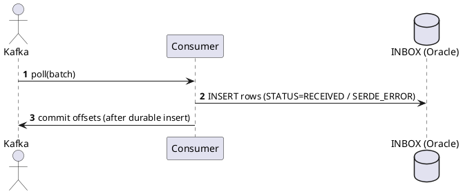
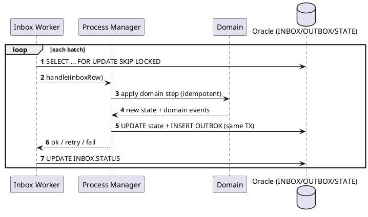

# Pattern Inbox/Outbox Transactionnel — Kafka → Salesforce

> **Stack cible** : Java, Spring Modulith, Kafka, Oracle.  
> **Objectif** : Garantir des **effets exactly-once** pour un flux **Kafka → (Inbox) → Traitement → (Outbox) → Salesforce (HTTP/Bulk)** avec résilience, observabilité et forte opérabilité.

---

## 1) Résumé exécutif
- **Inbox transactionnelle** : on **persiste chaque message Kafka** avant tout effet métier. Les erreurs de désérialisation (SERDE) sont **capturées quand même** (Base64), puis offsets **commit**.  
- **Traitement** : workers lisent l’Inbox avec `FOR UPDATE SKIP LOCKED`, orchestrent les étapes métier (idempotentes) et produisent des événements **Outbox**.
- **Outbox transactionnelle** : on **persiste** les messages destinés à Salesforce **dans la même transaction** que la mise à jour métier. Un Publisher HTTP (guardé par Resilience4j) pousse vers **Salesforce** (Bulk API 2.0/Collections/Composite) et marque `DISPATCHED`.
- **Payloads d’événements** : **IDs + version** (notification) → lecture des détails depuis Oracle juste avant l’envoi Salesforce (évite gros payloads et assure des données fraîches).

---

## 2) Architecture
```plantuml
@startuml
skinparam componentStyle rectangle
skinparam rectangle { BackgroundColor<<app>> #f7f7f7 }
cloud "Kafka" as K
cloud "Salesforce" as SF

database "Oracle" as ORA
rectangle "Spring Modulith App" <<app>> as APP {
  component "Inbound Messaging\n(Kafka Consumers)" as C
  component "Inbox (table + repo)" as INBOX
  component "Inbox Worker" as W
  component "Process Managers\n(API)" as PM
  component "Domain Aggregates\n& Repos" as D
  component "Outbox (table + repo)" as OUTBOX
  component "HTTP Publisher\n(Salesforce)" as HTTPP

  C --> INBOX
  INBOX --> W
  W --> PM
  PM --> D
  PM --> OUTBOX
  OUTBOX --> HTTPP
}
K --> C
HTTPP --> SF
D --> ORA
INBOX --> ORA
OUTBOX --> ORA
@enduml
```

---

## 3) Modèle de données Oracle
> JSON en **CLOB** avec `IS JSON` (ou type **JSON** si Oracle ≥ 21c).

### 3.0 Guide colonne par colonne (explications & conseils)

#### INBOX — réception Kafka (fiabilité de *receive*)
- **ID** — clé technique (IDENTITY). Pour les jointures/admin.
- **MESSAGE_ID** — identifiant de message *métier* ou Kafka (header ou calculé) → sert au **dédoublonnage**.
- **SOURCE_SYSTEM** — d’où vient l’event (ex. `ihub`, `crm-gateway`).
- **TOPIC / PARTITION_NUM / OFFSET_NUM** — trace Kafka pour investiguer/rejouer.
- **KEY_STR** — clé Kafka visible (utile pour l’ordonnancement par aggregate).
- **AGGREGATE_ID** — identifiant business agrégé (famille, client, hit…).
- **EVENT_TYPE** — type logique (`MembersCreated`, `BlocksToCreate`, …).
- **PAYLOAD** — contenu JSON **valide** (CLOB `IS JSON`) quand la désérialisation réussit.
- **HEADERS** — headers Kafka sérialisés en JSON (facilite la recherche / debug).
- **RAW_PAYLOAD_BASE64** — **octets d’origine encodés en Base64** quand SERDE échoue (payload non-JSON, binaire, tronqué…)
- **EVENT_TS** — timestamp d’occurrence porté par l’event (si disponible).
- **RECEIVED_AT** — horodatage d’insertion en base.
- **STATUS** — `RECEIVED|RETRY|FAILED|PROCESSED|SERDE_ERROR`.
- **ATTEMPTS** — nombre de tentatives de traitement (business) déjà faites.
- **NEXT_ATTEMPT_AT** — backoff calculé (pour les `RETRY`).
- **PROCESSED_AT** — horodatage de fin avec succès.
- **ERROR_STAGE** — `CONSUMER_SERDE` (désérialisation) ou `BUSINESS`.
- **ERROR_CODE / ERROR_MESSAGE** — pour diagnostiquer, classer et automatiser.

> **Optionnels** pouvant être supprimés si besoin de réduire : `KEY_STR`, `EVENT_TS`, `PROCESSED_AT`, voire `HEADERS` (si vous acceptez moins de traçabilité). Garder **MESSAGE_ID**, **STATUS**, **PAYLOAD / RAW_PAYLOAD_BASE64**, **NEXT_ATTEMPT_AT**.

#### OUTBOX — envoi Salesforce (fiabilité de *send*)
- **ID** — clé technique.
- **AGGREGATE_TYPE / AGGREGATE_ID** — rattachement business et clé naturelle (utile pour idempotence métier et requêtes ciblées).
- **EVENT_TYPE** — nature de ce qu’on publie (`MembersUpsertRequested`, …).
- **EVENT_VERSION** — versioning de contrat pour gérer les évolutions.
- **PAYLOAD** — JSON à destination du publisher (toujours **valide**).
- **HEADERS** — méta facultatives (correlation, user…)
- **DESTINATION** — ex. `HTTP:SFDC:BulkV2:Contact`.
- **CREATED_AT** — traçabilité.
- **STATUS** — `PENDING|DISPATCHED|FAILED`.
- **ATTEMPTS / NEXT_ATTEMPT_AT** — stratégie retry (HTTP).
- **ERROR_CODE / ERROR_MESSAGE** — diagnostic et reporting.

> **Optionnels**: `HEADERS` et `EVENT_VERSION` si vous versionnez dans `EVENT_TYPE`; `AGGREGATE_TYPE` si vous n’avez qu’un seul type par table. À conserver : **DESTINATION**, **STATUS**, **PAYLOAD**, **ATTEMPTS/NEXT_ATTEMPT_AT**.

### 3.1 INBOX
> JSON en **CLOB** avec `IS JSON` (ou type **JSON** si Oracle ≥ 21c).

### 3.1 INBOX
```sql
CREATE TABLE INBOX (
  ID                 NUMBER GENERATED BY DEFAULT AS IDENTITY PRIMARY KEY,
  MESSAGE_ID         VARCHAR2(200)      NOT NULL,
  SOURCE_SYSTEM      VARCHAR2(100)      NOT NULL,
  TOPIC              VARCHAR2(200)      NOT NULL,
  PARTITION_NUM      NUMBER(10)         NOT NULL,
  OFFSET_NUM         NUMBER(19)         NOT NULL,
  KEY_STR            VARCHAR2(4000),
  AGGREGATE_ID       VARCHAR2(200),
  EVENT_TYPE         VARCHAR2(200),
  PAYLOAD            CLOB               CHECK (PAYLOAD IS JSON),
  HEADERS            CLOB               CHECK (HEADERS IS JSON),
  RAW_PAYLOAD_BASE64 CLOB,                                 -- octets bruts en Base64 si SERDE KO
  EVENT_TS           TIMESTAMP WITH TIME ZONE,
  RECEIVED_AT        TIMESTAMP WITH TIME ZONE DEFAULT SYSTIMESTAMP NOT NULL,
  STATUS             VARCHAR2(20)       DEFAULT 'RECEIVED' NOT NULL,
  ATTEMPTS           NUMBER(10)         DEFAULT 0 NOT NULL,
  NEXT_ATTEMPT_AT    TIMESTAMP WITH TIME ZONE,
  PROCESSED_AT       TIMESTAMP WITH TIME ZONE,
  ERROR_CODE         VARCHAR2(200),
  ERROR_MESSAGE      VARCHAR2(2000),
  ERROR_STAGE        VARCHAR2(50),      -- CONSUMER_SERDE / BUSINESS
  CONSTRAINT UX_INBOX_DEDUPE UNIQUE (SOURCE_SYSTEM, MESSAGE_ID),
  CONSTRAINT CK_INBOX_STATUS CHECK (STATUS IN ('RECEIVED','RETRY','FAILED','PROCESSED','SERDE_ERROR')),
  CONSTRAINT CK_INBOX_PAYLOAD_OR_RAW CHECK (PAYLOAD IS NOT NULL OR RAW_PAYLOAD_BASE64 IS NOT NULL)
);

CREATE INDEX IX_INBOX_STATUS_DUE ON INBOX (STATUS, NEXT_ATTEMPT_AT);
CREATE INDEX IX_INBOX_AGG       ON INBOX (AGGREGATE_ID);
```

### 3.2 OUTBOX
```sql
CREATE TABLE OUTBOX (
  ID              NUMBER GENERATED BY DEFAULT AS IDENTITY PRIMARY KEY,
  AGGREGATE_TYPE  VARCHAR2(50)   NOT NULL,
  AGGREGATE_ID    VARCHAR2(200)  NOT NULL,
  EVENT_TYPE      VARCHAR2(200)  NOT NULL,
  EVENT_VERSION   NUMBER(5)      DEFAULT 1 NOT NULL,
  PAYLOAD         CLOB           NOT NULL CHECK (PAYLOAD IS JSON),
  HEADERS         CLOB           CHECK (HEADERS IS JSON),
  DESTINATION     VARCHAR2(200)  NOT NULL,  -- e.g. HTTP:SFDC:BulkV2:Contact
  CREATED_AT      TIMESTAMP WITH TIME ZONE DEFAULT SYSTIMESTAMP NOT NULL,
  STATUS          VARCHAR2(20)   DEFAULT 'PENDING' NOT NULL,
  ATTEMPTS        NUMBER(10)     DEFAULT 0 NOT NULL,
  NEXT_ATTEMPT_AT TIMESTAMP WITH TIME ZONE,
  ERROR_CODE      VARCHAR2(200),
  ERROR_MESSAGE   VARCHAR2(2000),
  CONSTRAINT CK_OUTBOX_STATUS CHECK (STATUS IN ('PENDING','DISPATCHED','FAILED'))
);

CREATE INDEX IX_OUTBOX_PENDING ON OUTBOX (STATUS, NEXT_ATTEMPT_AT);
CREATE INDEX IX_OUTBOX_AGG     ON OUTBOX (AGGREGATE_TYPE, AGGREGATE_ID);
```

---

## 4) Séquences principales

### 4.1 Kafka → Inbox (store → commit)


### 4.2 Inbox → Traitement → Outbox (TX unique par étape)


### 4.3 Outbox → Salesforce (Bulk API 2.0)
```plantuml
@startuml
autonumber
participant "HTTP Publisher" as HP
cloud "Salesforce Bulk API 2.0" as SF
HP -> SF : POST /jobs/ingest (create job)
SF --> HP : jobId
HP -> SF : PUT /jobs/ingest/{jobId}/batches (CSV/JSONL)
SF --> HP : accepted
HP -> SF : PATCH /jobs/ingest/{jobId} (state=CLOSED)
SF --> HP : ok
loop poll
  HP -> SF : GET /jobs/ingest/{jobId}
  SF --> HP : state=Open/JobComplete/Failed
end
HP -> SF : GET /jobs/ingest/{jobId}/successfulResults
HP -> SF : GET /jobs/ingest/{jobId}/failedResults
@enduml
```

---

## 5) Ingestion Kafka (Spring) — *store then commit*

### 5.1 Consumer (batch, ack manuel) + capture SERDE (Base64)
```java
@KafkaListener(topics = "members-created", containerFactory = "manualAckBatchFactory")
public void onBatch(List<ConsumerRecord<String, String>> records, Acknowledgment ack) {
  for (var r : records) {
    try {
      inboxRepo.insertIfAbsent(
        msgId(r), "ihub", r.topic(), r.partition(), r.offset(), r.key(),
        aggregateId(r), eventType(r), r.value(), headersJson(r.headers()),
        Instant.ofEpochMilli(r.timestamp()));
    } catch (Exception e) {
      var raw = r.value();
      var b64 = raw != null ? Base64.getEncoder().encodeToString(raw.getBytes(StandardCharsets.UTF_8)) : null;
      inboxRepo.insertSerdeError(
        safeMsgId(r), "ihub", r.topic(), r.partition(), r.offset(), r.key(),
        b64, headersJson(r.headers()), e.getClass().getSimpleName(), String.valueOf(e.getMessage()));
    }
  }
  ack.acknowledge();
}
```

### 5.2 Error handler pour désérialisation
```java
@Bean
CommonErrorHandler errorHandler(InboxSerdeRecoverer recoverer) {
  var backoff = new FixedBackOff(0L, 0);
  var h = new DefaultErrorHandler((rec, ex) -> recoverer.persist(rec, ex), backoff);
  h.addNotRetryableExceptions(org.springframework.kafka.support.serializer.DeserializationException.class);
  return h;
}

@Component
class InboxSerdeRecoverer {
  @Autowired InboxRepository repo;
  public void persist(ConsumerRecord<?, ?> rec, Exception ex) {
    byte[] bytes = ex instanceof DeserializationException de ? de.getData() : null;
    String b64 = bytes != null ? Base64.getEncoder().encodeToString(bytes) : null;
    repo.insertSerdeError(
      safeMessageId(rec), "ihub", rec.topic(), rec.partition(), rec.offset(),
      rec.key()==null?null:rec.key().toString(), b64, headersAsJson(rec.headers()),
      ex.getClass().getSimpleName(), String.valueOf(ex.getMessage()));
  }
}
```

### 5.3 Repository Oracle (INSERT/MERGE)
```java
@Modifying @Transactional
@Query(value = """
MERGE INTO INBOX t
USING (SELECT :messageId AS MESSAGE_ID, :sourceSystem AS SOURCE_SYSTEM FROM dual) s
ON (t.SOURCE_SYSTEM = s.SOURCE_SYSTEM AND t.MESSAGE_ID = s.MESSAGE_ID)
WHEN NOT MATCHED THEN INSERT (
  MESSAGE_ID, SOURCE_SYSTEM, TOPIC, PARTITION_NUM, OFFSET_NUM, KEY_STR,
  AGGREGATE_ID, EVENT_TYPE, PAYLOAD, HEADERS, EVENT_TS, STATUS, RECEIVED_AT)
VALUES (
  :messageId, :sourceSystem, :topic, :partitionNum, :offsetNum, :keyStr,
  :aggregateId, :eventType, :payloadJson, :headersJson, :eventTs, 'RECEIVED', SYSTIMESTAMP)
""", nativeQuery = true)
int insertIfAbsent(/* params */);

@Modifying @Transactional
@Query(value = """
INSERT INTO INBOX (MESSAGE_ID, SOURCE_SYSTEM, TOPIC, PARTITION_NUM, OFFSET_NUM, KEY_STR,
                   RAW_PAYLOAD_BASE64, HEADERS, EVENT_TS, STATUS, ERROR_STAGE,
                   ERROR_CODE, ERROR_MESSAGE, RECEIVED_AT)
VALUES (:messageId, :sourceSystem, :topic, :partitionNum, :offsetNum, :keyStr,
        :rawPayloadBase64, :headersJson, SYSTIMESTAMP, 'SERDE_ERROR', 'CONSUMER_SERDE',
        :errorCode, :errorMessage, SYSTIMESTAMP)
""", nativeQuery = true)
int insertSerdeError(/* params */);
```

---

## 6) Outbox → Salesforce (HTTP) — Publisher résilient

### 6.1 Stratégie de payload
- **Événements légers** : IDs + `asOfVersion` / `eventVersion` → **rehydrate** depuis Oracle juste avant envoi.
- **Idempotence** : côté Salesforce via **External ID** + **Upsert** ; côté app via `OUTBOX.ID` et statut `DISPATCHED`.

### 6.2 Pseudo‑code Publisher Bulk v2
```java
@Service
class SfdcOutboxPublisher {
  @Scheduled(fixedDelayString = "${outbox.publisher.delay:1000}")
  @Transactional
  public void tick() {
    var groups = outbox.lockPendingGrouped("HTTP:SFDC:BulkV2:Contact", 1000);
    for (var g : groups) {
      try {
        var ids = g.collectIds();
        var rows = memberRepo.findAllByIdIn(ids);           // lecture DB en lot
        var bulkFile = toBulkCsv(rows);                      // ou JSON Lines
        var jobId = sfdc.bulk().createJob("Contact", UPSERT, "ExternalId__c");
        sfdc.bulk().upload(jobId, bulkFile);
        sfdc.bulk().close(jobId);
        var result = sfdc.bulk().awaitResults(jobId);        // poll + time limiter
        outbox.resolveWithRowResults(g, result);             // DISPATCHED/RETRY/FAILED par ligne
      } catch (RetryableHttp e) {
        outbox.markRetry(g.ids(), nextBackoff(g.maxAttempts()));
      } catch (PermanentHttp e) {
        outbox.markFailed(g.ids(), e.code(), e.getMessage());
      }
    }
  }
}
```

### 6.3 Resilience4j (exemple)
```yaml
resilience4j:
  ratelimiter:
    instances:
      sfdc:
        limit-for-period: 50
        limit-refresh-period: 1s
        timeout-duration: 2s
  circuitbreaker:
    instances:
      sfdc:
        sliding-window-size: 50
        failure-rate-threshold: 50
        wait-duration-in-open-state: 30s
  bulkhead:
    instances:
      sfdc:
        max-concurrent-calls: 10
  timelimiter:
    instances:
      sfdc:
        timeout-duration: 30s
```

---

## 7) Exemples d’événements & mapping

> **Exemples simples (PlantUML)** pour visualiser sans surcharge.

### 7.0 Séquence minimale : un membre → Salesforce
```plantuml
@startuml
autonumber
Kafka -> Consumer : record {memberId}
Consumer -> INBOX : INSERT (RECEIVED)
Consumer -> Kafka : commit offset
INBOX Worker -> INBOX : lock next
INBOX Worker -> DB : SELECT member by id
INBOX Worker -> OUTBOX : INSERT (PENDING, payload minimal)
HTTP Publisher -> Salesforce : Bulk upsert
HTTP Publisher -> OUTBOX : UPDATE status=DISPATCHED
@enduml
```

### 7.1 MembersCreated (event minimal)
```json
{
  "type": "MembersCreated",
  "familyId": "F-8842",
  "memberIds": ["M-1","M-2","M-450"],
  "asOfVersion": 7,
  "eventVersion": 2
}
```

**Hydratation** (Oracle)
```sql
SELECT * FROM MEMBERS WHERE ID IN (:ids);
```

**Bulk v2 (CSV)**
```csv
ExternalId__c,FirstName,LastName,Email,Family__c
M-1,Jane,Doe,jane@example.com,F-8842
M-2,John,Doe,john@example.com,F-8842
...
```

### 7.2 BlocksToCreate (event minimal)
```json
{
  "type": "BlocksToCreate",
  "familyId": "F-8842",
  "blockType": "RISK",
  "blockIds": ["B-1","B-2","B-2000"],
  "eventVersion": 1
}
```

### 7.1 MembersCreated (event minimal)
```json
{
  "type": "MembersCreated",
  "familyId": "F-8842",
  "memberIds": ["M-1","M-2","M-450"],
  "asOfVersion": 7,
  "eventVersion": 2
}
```

**Hydratation** (Oracle)
```sql
SELECT * FROM MEMBERS WHERE ID IN (:ids);
```

**Bulk v2 (CSV)**
```csv
ExternalId__c,FirstName,LastName,Email,Family__c
M-1,Jane,Doe,jane@example.com,F-8842
M-2,John,Doe,john@example.com,F-8842
...
```

### 7.2 BlocksToCreate (event minimal)
```json
{
  "type": "BlocksToCreate",
  "familyId": "F-8842",
  "blockType": "RISK",
  "blockIds": ["B-1","B-2","B-2000"],
  "eventVersion": 1
}
```

---

## 8) Observabilité & SLO
- **INBOX** : profondeur, âge max, %SERDE_ERROR, retries/failed.
- **OUTBOX** : en attente, latence de dispatch, %réussite/échec, codes erreurs par sObject.
- **Business** : latence bout‑à‑bout (INBOX→DISPATCHED), records/h.

---

## 9) Plan de tests (critique)
- **SERDE KO** : ligne INBOX `SERDE_ERROR` avec `RAW_PAYLOAD_BASE64` non vide, offsets commit.
- **Duplicate delivery** : `UX_INBOX_DEDUPE` évite les doublons, effets idempotents.
- **Out‑of‑order** : contrôlé par le Process Manager (version/state).
- **Bulk partiellement OK** : seulement les lignes en échec restent en `RETRY`.
- **Throttling** : 429/503 → backoff + RateLimiter ; circuit breaker ouvert → pas d’épuisement.

---

## 10) Décisions clés & anti‑patterns
**Décisions**
- Événements **légers (IDs + version)** ; hydratation DB avant envoi SFDC.
- Inbox/Outbox **durables** + workers parallèles (`SKIP LOCKED`).
- **Base64** pour les values invalides (SERDE) afin de garder les octets d’origine.
- **Upsert** Salesforce via **External ID** pour l’idempotence côté cible.

**À éviter**
- Payloads d’événements « gras » (duplication massive, obsolescence).
- Appels REST unitaires par milliers → préférer **Bulk API 2.0**.
- Ignorer les limites/rate‑limits → ajouter Resilience4j + métriques.

---

## 11) Annexes — Snippets utiles

### 11.0 Schéma *allégé* (si besoin de réduire encore)

#### INBOX_MIN (strict minimum recommandé)
```sql
CREATE TABLE INBOX_MIN (
  ID NUMBER GENERATED BY DEFAULT AS IDENTITY PRIMARY KEY,
  MESSAGE_ID VARCHAR2(200) NOT NULL,
  SOURCE_SYSTEM VARCHAR2(100) NOT NULL,
  PAYLOAD CLOB CHECK (PAYLOAD IS JSON),
  RAW_PAYLOAD_BASE64 CLOB,
  STATUS VARCHAR2(20) DEFAULT 'RECEIVED' NOT NULL,
  NEXT_ATTEMPT_AT TIMESTAMP WITH TIME ZONE,
  ATTEMPTS NUMBER(10) DEFAULT 0 NOT NULL,
  CONSTRAINT UX_DEDUPE UNIQUE (SOURCE_SYSTEM, MESSAGE_ID)
);
```
> Vous perdez la traçabilité Kafka (topic/offset) et les métadonnées (headers, erreurs). À n’utiliser que si la base doit rester **très compacte** et que l’observabilité est reportée ailleurs.

#### OUTBOX_MIN
```sql
CREATE TABLE OUTBOX_MIN (
  ID NUMBER GENERATED BY DEFAULT AS IDENTITY PRIMARY KEY,
  DESTINATION VARCHAR2(200) NOT NULL,
  PAYLOAD CLOB CHECK (PAYLOAD IS JSON),
  STATUS VARCHAR2(20) DEFAULT 'PENDING' NOT NULL,
  NEXT_ATTEMPT_AT TIMESTAMP WITH TIME ZONE,
  ATTEMPTS NUMBER(10) DEFAULT 0 NOT NULL
);
```

### 11.1 Query Oracle (déqueue)
```sql
SELECT * FROM INBOX
WHERE STATUS IN ('RECEIVED','RETRY')
  AND (NEXT_ATTEMPT_AT IS NULL OR NEXT_ATTEMPT_AT <= SYSTIMESTAMP)
ORDER BY RECEIVED_AT
FETCH FIRST 200 ROWS ONLY
FOR UPDATE SKIP LOCKED;
```

### 11.2 Outbox pending
```sql
SELECT * FROM OUTBOX
WHERE STATUS = 'PENDING'
  AND (NEXT_ATTEMPT_AT IS NULL OR NEXT_ATTEMPT_AT <= SYSTIMESTAMP)
ORDER BY CREATED_AT
FETCH FIRST 500 ROWS ONLY
FOR UPDATE SKIP LOCKED;
```

### 11.1 Query Oracle (déqueue)
```sql
SELECT * FROM INBOX
WHERE STATUS IN ('RECEIVED','RETRY')
  AND (NEXT_ATTEMPT_AT IS NULL OR NEXT_ATTEMPT_AT <= SYSTIMESTAMP)
ORDER BY RECEIVED_AT
FETCH FIRST 200 ROWS ONLY
FOR UPDATE SKIP LOCKED;
```

### 11.2 Outbox pending
```sql
SELECT * FROM OUTBOX
WHERE STATUS = 'PENDING'
  AND (NEXT_ATTEMPT_AT IS NULL OR NEXT_ATTEMPT_AT <= SYSTIMESTAMP)
ORDER BY CREATED_AT
FETCH FIRST 500 ROWS ONLY
FOR UPDATE SKIP LOCKED;
```


---

## 16) Références — Docs officielles & guides
> Liens pratiques (copiez/collez dans votre navigateur)

```text
Spring Modulith — Events & EventSerializer:
  https://docs.spring.io/spring-modulith/reference/events.html
  https://docs.spring.io/spring-modulith/docs/current/api/org/springframework/modulith/events/jackson/package-summary.html

Spring Kafka — Error handling & ErrorHandlingDeserializer:
  https://docs.spring.io/spring-kafka/reference/kafka/annotation-error-handling.html
  https://docs.spring.io/spring-kafka/api/org/springframework/kafka/support/serializer/ErrorHandlingDeserializer.html

Oracle — JSON & IS JSON / SKIP LOCKED:
  https://docs.oracle.com/en/database/oracle/oracle-database/21/adjsn/conditions-is-json-and-is-not-json.html
  https://docs.oracle.com/en/database/oracle/oracle-database/23/adjsn/json-data-type.html
  https://asktom.oracle.com/ords/asktom.search?tag=select-for-update-skip-locked

Salesforce — Bulk API 2.0 / Collections / Composite (choix API):
  https://developer.salesforce.com/docs/atlas.en-us.api_asynch.meta/api_asynch/bulk_api_2_0_ingest.htm
  https://developer.salesforce.com/docs/atlas.en-us.salesforce_app_limits_cheatsheet.meta/salesforce_app_limits_cheatsheet/salesforce_app_limits_platform_bulkapi.htm
  https://developer.salesforce.com/docs/atlas.en-us.api_rest.meta/api_rest/resources_composite_sobjects_collections.htm
  https://developer.salesforce.com/docs/atlas.en-us.api_rest.meta/api_rest/resources_composite_composite_post.htm

Resilience4j — RateLimiter / Getting started:
  https://resilience4j.readme.io/docs/ratelimiter
  https://resilience4j.readme.io/docs/getting-started
```

