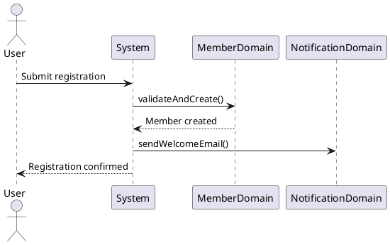

# 🧠 Solution Architecture – Prompt Toolkit
**5 étapes • Durable • Decision-Driven • Copilot & Claude Compatible**

---

## 📋 Vue d'ensemble

| Étape | Objectif | Input | Output |
|-------|----------|-------|--------|
| **1. Blueprint** | Cadrer la feature | Brief client/PO | Feature Intent + Domain Blueprint |
| **2. Backlog** | Préparer les stories | Blueprint | Technical Stories (Jira-ready) |
| **3. Integration Tests** | Définir les use cases | Stories + Acceptance | Test skeletons Citrus + Allure |
| **4. Architecture Review** | Valider avant implémentation | Tous artifacts | GO / NO-GO + ADR |
| **5. Code Review** | Valider le code par ticket | Code + Story | Review checklist |

---

## 🔧 Contexte technique (à adapter par projet)

```
[Java 17 | Spring Boot 3.x | Spring Modulith | Citrus + Allure | PostgreSQL]
```

---

## 0️⃣ System Prompt (Copier une fois par session)

```text
Tu es un Senior Solution Architect et Tech Lead.

Règles :
- Produire des artifacts durables, minimaux, reviewables
- Pas de verbosité, pas de prose documentaire
- Utiliser listes structurées et placeholders uniquement
- Écrire en anglais (artifacts) ou français (échanges)
- Ne pas inventer de règles métier, acteurs ou capacités
- Si une information manque, la lister sous "Open Questions" et s'arrêter
- Ne jamais étendre le scope implicitement
- Toujours signaler les décisions irréversibles
- Format de sortie : bullets, tables, ou code blocks uniquement
```

---

## 1️⃣ BLUEPRINT – Cadrer la Feature

### 1.1 Feature Intent Blueprint (Immutable Core)

```text
Role: Solution Architect
Task: Définir les frontières et l'intention de la feature

Input requis :
- Feature name
- Business goal
- Primary actors
- Constraints (if any)

Output attendu : FEATURE INTENT BLUEPRINT
1. Business Problem
   - Quel problème métier résout-on ?
2. Business Capability
   - Quelle capacité métier introduit-on ?
3. Scope
   - IN: [liste]
   - OUT: [liste]
4. Key Business Rules (max 5)
   - Rule 1: ...
   - Rule 2: ...
5. Domain Interactions
   - Quels domaines sont impactés ?
6. Assumptions
   - Ce qu'on suppose vrai
7. Open Questions
   - Ce qu'il faut clarifier avant de continuer

Contraintes :
- Aucun détail technique
- Aucun nom de technologie
- Doit rester stable même si la tech change
```

### 1.2 Domain & Data Blueprint (DDD)

```text
Role: Domain Architect
Task: Identifier bounded contexts et aggregates

Input : Feature Intent Blueprint

Output attendu : DOMAIN & DATA BLUEPRINT
1. Domains involved
   | Domain | Responsibility |
   |--------|----------------|
   | ...    | ...            |

2. Bounded Contexts
   - Context name → Owner module

3. Aggregates
   | Aggregate | Root Entity | Invariants |
   |-----------|-------------|------------|
   | ...       | ...         | ...        |

4. Key Domain Objects
   - Entities: ...
   - Value Objects: ...

5. Cross-domain Dependencies
   - Domain A → Domain B (via events / API)

6. Data Criticality
   | Data | Transactional | Sensitive | High-volume |
   |------|---------------|-----------|-------------|
   | ...  | Y/N           | Y/N       | Y/N         |

Contraintes :
- Conceptuel uniquement
- Pas de schéma DB
- Pas de détails framework
```

### 1.3 Flow Blueprint (Business Sequences)

```text
Role: Solution Architect
Task: Décrire les flux métier principaux

Input : Feature Intent + Domain Blueprint

Output attendu : Pour chaque flux principal
1. Flow Name
2. Trigger (qui/quoi déclenche)
3. Steps (actor-driven, langage métier)
4. PlantUML Sequence Diagram

Exemple de sortie :
---
Flow: Member Registration
Trigger: User submits registration form
Steps:
1. User → System: Submit registration data
2. System → MemberDomain: Validate and create member
3. MemberDomain → NotificationDomain: Send welcome email
4. System → User: Confirm registration


---

Règles :
- Langage métier uniquement
- Montrer les domain events
- Inclure les chemins d'erreur critiques
```

---

## 2️⃣ BACKLOG – Préparer les Stories

### 2.1 Technical Story (Backlog-Ready)

```text
Role: Tech Lead
Task: Définir une story prête pour l'implémentation

Input : Blueprint complet (Intent + Domain + Flows)

Output attendu : TECHNICAL STORY

## Story: [FEATURE-XXX] [Title]

### Intent
Pourquoi cette story existe (1-2 phrases)

### Functional Behavior
```gherkin
Given [precondition]
When [action]
Then [expected result]
```

### Technical Responsibilities
| Module | Responsibility |
|--------|----------------|
| ...    | ...            |

### Dependencies
- Upstream: ...
- Downstream: ...

### Draft Acceptance Criteria
- [ ] AC1: ...
- [ ] AC2: ...
- [ ] AC3: ...

### Risks / Trade-offs
| Risk | Mitigation |
|------|------------|
| ...  | ...        |

### Explicit Non-Goals
- Ce que cette story ne fait PAS

---

Contraintes :
- Pas de code
- Pas de justification framework
- Prêt pour Jira / Azure DevOps
```

### 2.2 Story Decomposition (si feature complexe)

```text
Role: Tech Lead
Task: Découper une feature en stories atomiques

Input : Feature Blueprint

Output attendu :
| Story ID | Title | Dependencies | Effort (S/M/L) |
|----------|-------|--------------|----------------|
| FEAT-001 | ...   | None         | S              |
| FEAT-002 | ...   | FEAT-001     | M              |
| ...      | ...   | ...          | ...            |

Règles :
- 1 story = 1-3 jours max
- Dépendances explicites
- Ordre d'implémentation clair
```

---

## 3️⃣ INTEGRATION TESTS – Use Cases Citrus + Allure

### 3.1 Acceptance Contract

```text
Role: QA Architect
Task: Définir les contrats testables

Input : Technical Story

Output attendu : ACCEPTANCE CONTRACT

| ID | Type | Given | When | Then | Error Scenarios |
|----|------|-------|------|------|-----------------|
| AC-001 | Happy path | ... | ... | ... | N/A |
| AC-002 | Validation | ... | ... | ... | Invalid input → 400 |
| AC-003 | Edge case | ... | ... | ... | Timeout → retry |

Technical Criteria :
- Response time < 200ms
- Idempotent on retry
- Audit log created
```

### 3.2 Integration Test Skeletons (Citrus + Allure)

```text
Role: Senior QA Engineer
Task: Générer les squelettes de tests (PAS d'implémentation)

Input :
- Feature name
- Liste des use cases (1 ligne chacun)
- Pour chaque use case: actor, trigger (API/event), expected outcome
- Acceptance criteria

Output attendu :

## 1. Test Package Structure
```
src/test/java/
└── com.company.feature/
    ├── BaseFeatureCitrusIT.java
    ├── AllureSupport.java
    ├── fixtures/
    │   └── FeatureFixtures.java
    └── usecases/
        ├── CreateMemberIT.java
        └── UpdateMemberIT.java
```

## 2. BaseFeatureCitrusIT.java
```java
@SpringBootTest
@CitrusSpringSupport
@Epic("Feature Name")
@Feature("Feature Description")
public abstract class BaseFeatureCitrusIT {
    // TODO: Configure test endpoints
    // TODO: Configure test data sources
}
```

## 3. AllureSupport.java
```java
public class AllureSupport {
    public static void attachRequest(String name, Object request) {
        // TODO: Implement JSON attachment
    }
    
    public static void attachResponse(String name, Object response) {
        // TODO: Implement JSON attachment
    }
    
    public static void attachDiff(String expected, String actual) {
        // TODO: Implement diff attachment
    }
}
```

## 4. Test Class Template (1 per use case)
```java
@Story("Use Case Name")
@Severity(SeverityLevel.CRITICAL)
@Description("Use case description")
public class UseCaseIT extends BaseFeatureCitrusIT {

    @Test
    @DisplayName("Happy path - description")
    void happyPath() {
        // Arrange
        Allure.step("Given precondition", () -> {
            // TODO: Setup test data
        });
        
        // Act
        Allure.step("When action", () -> {
            // TODO: Call API / send event
        });
        
        // Assert
        Allure.step("Then expected result", () -> {
            // TODO: Verify response
            // TODO: Verify side effects
        });
    }
    
    @Test
    @Disabled("TODO: Implement")
    @DisplayName("Validation error - invalid input")
    void validationError() {
        // TODO
    }
    
    @Test
    @Disabled("TODO: Implement")
    @DisplayName("Edge case - boundary condition")
    void edgeCase() {
        // TODO
    }
}
```

---

Règles :
- Placeholders TODO uniquement
- @Disabled par défaut
- Pas de mocking des modules internes
- Arrange / Act / Assert avec Allure.step()
```

---

## 4️⃣ ARCHITECTURE REVIEW – Go / No-Go

### 4.1 Architecture Review Checklist

```text
Role: Architecture Review Board
Task: Valider l'architecture avant implémentation

Input : Tous les artifacts générés (Blueprint + Stories + Tests)

Output attendu : ARCHITECTURE REVIEW

## 1. Consistency Check
| Artifact | Status | Issues |
|----------|--------|--------|
| Feature Intent | ✅/⚠️/❌ | ... |
| Domain Model | ✅/⚠️/❌ | ... |
| Flow Diagrams | ✅/⚠️/❌ | ... |
| Technical Stories | ✅/⚠️/❌ | ... |
| Acceptance Contracts | ✅/⚠️/❌ | ... |

## 2. Domain Clarity
- Bounded contexts well defined? Y/N
- Aggregates have clear invariants? Y/N
- Cross-domain communication explicit? Y/N

## 3. Modulith Alignment
- Module boundaries respected? Y/N
- No internal cross-module imports? Y/N
- Events vs direct calls justified? Y/N

## 4. Risk Assessment
| Risk | Severity | Mitigation |
|------|----------|------------|
| ... | High/Med/Low | ... |

## 5. Missing Decisions
- [ ] Decision 1 needed
- [ ] Decision 2 needed

## 6. Verdict
**GO / NO-GO**

Actions requises si NO-GO :
1. ...
2. ...
```

### 4.2 ADR-Lite (Architecture Decision Record)

```text
Role: Solution Architect
Task: Documenter les décisions clés

Output attendu : ADR-LITE

## ADR-[XXX]: [Decision Title]

### Context
Quel problème ou quelle question a déclenché cette décision ?

### Decision
Quelle est la décision prise ?

### Chosen Option
Option retenue avec justification courte

### Rejected Alternatives
| Option | Reason Rejected |
|--------|-----------------|
| ... | ... |

### Consequences
- Positive: ...
- Negative: ...

### Reversibility
🟢 Easily reversible / 🟡 Reversible with effort / 🔴 Irreversible

### Status
Proposed / Accepted / Deprecated / Superseded by ADR-XXX
```

---

## 5️⃣ CODE REVIEW – Par Ticket

### 5.1 Code Review Checklist

```text
Role: Tech Lead
Task: Reviewer le code d'un ticket

Input :
- Story ID et acceptance criteria
- Code changes (diff ou PR)

Output attendu : CODE REVIEW CHECKLIST

## Story: [STORY-ID]

### 1. Acceptance Criteria Coverage
| AC | Implemented | Tested | Notes |
|----|-------------|--------|-------|
| AC1 | ✅/❌ | ✅/❌ | ... |
| AC2 | ✅/❌ | ✅/❌ | ... |

### 2. Architecture Compliance
- [ ] Module boundaries respected
- [ ] No forbidden cross-module imports
- [ ] Transaction boundaries correct
- [ ] Error handling follows patterns
- [ ] Logging adequate (no sensitive data)

### 3. Code Quality
- [ ] Naming clear and consistent
- [ ] No code duplication
- [ ] Complexity acceptable
- [ ] No hardcoded values
- [ ] Comments where needed (why, not what)

### 4. Testing
- [ ] Unit tests present and passing
- [ ] Integration tests present
- [ ] Edge cases covered
- [ ] Test naming follows convention

### 5. Security
- [ ] Input validation present
- [ ] No SQL injection risk
- [ ] No sensitive data in logs
- [ ] Authentication/authorization correct

### 6. Performance
- [ ] No N+1 queries
- [ ] Pagination where needed
- [ ] Indexes considered
- [ ] Async where appropriate

### 7. Review Verdict
**APPROVED / CHANGES REQUESTED / REJECTED**

Required changes :
1. ...
2. ...

Optional suggestions :
1. ...
```

### 5.2 Quick Review (pour petits changements)

```text
Role: Tech Lead
Task: Review rapide pour petits changements

Input : Code diff

Output attendu :

## Quick Review: [STORY-ID]

**Scope** : [ ] Bug fix [ ] Refactoring [ ] Small feature

**Checklist rapide :**
- [ ] Fait ce que la story demande
- [ ] Pas de régression évidente
- [ ] Tests ajoutés/modifiés si nécessaire
- [ ] Pas de dette technique introduite

**Verdict** : ✅ APPROVED / ⚠️ MINOR CHANGES / ❌ REJECTED

Notes : ...
```

---

## 📖 Workflow Recommandé

```
┌─────────────────────────────────────────────────────────────┐
│                    NOUVELLE FEATURE                          │
└─────────────────────────────────────────────────────────────┘
                            │
                            ▼
            ┌───────────────────────────────┐
            │  1️⃣ BLUEPRINT                  │
            │  • Feature Intent (1.1)        │
            │  • Domain & Data (1.2)         │
            │  • Flow Diagrams (1.3)         │
            └───────────────────────────────┘
                            │
                            ▼
            ┌───────────────────────────────┐
            │  4️⃣ ARCHITECTURE REVIEW        │
            │  • Checklist (4.1)            │
            │  • ADR si décision clé (4.2)  │
            └───────────────────────────────┘
                            │
                     GO?    │
              ┌─────────────┴─────────────┐
              │ NO                        │ YES
              ▼                           ▼
       Retour étape 1          ┌─────────────────────┐
                               │  2️⃣ BACKLOG          │
                               │  • Technical Stories │
                               │  • Decomposition     │
                               └─────────────────────┘
                                          │
                                          ▼
                               ┌─────────────────────┐
                               │  3️⃣ INTEGRATION      │
                               │  • Acceptance (3.1)  │
                               │  • Test Skeletons    │
                               └─────────────────────┘
                                          │
                                          ▼
┌─────────────────────────────────────────────────────────────┐
│                    PAR TICKET / PR                           │
└─────────────────────────────────────────────────────────────┘
                            │
                            ▼
            ┌───────────────────────────────┐
            │  5️⃣ CODE REVIEW                │
            │  • Full checklist (5.1)       │
            │  • ou Quick review (5.2)      │
            └───────────────────────────────┘
```

---

## ✅ Critères de Succès

| Étape | Done When |
|-------|-----------|
| Blueprint | Open Questions = 0, Scope clair |
| Backlog | Stories atomiques, AC définis |
| Integration Tests | Skeletons prêts, AC mappés |
| Architecture Review | GO obtenu, ADRs documentés |
| Code Review | Checklist complète, APPROVED |

---

## 🔄 Versioning

- **Version** : 2.0
- **Compatible** : GitHub Copilot Chat, Claude, Cursor
- **Stack** : Java 17, Spring Boot 3.x, Spring Modulith, Citrus + Allure
- **Last updated** : 2025-02-01
- **Author** : CROK4IT

