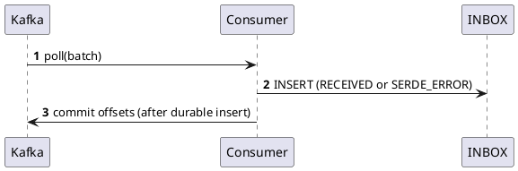

# Transactional Inbox/Outbox — Kafka → Salesforce (EN)

> **Stack**: Java, Spring Modulith, Kafka, Oracle  
> **Goal**: Achieve **exactly-once effects** for a **Kafka → (Inbox) → Processing → (Outbox) → Salesforce (HTTP/Bulk)** pipeline with resilience, observability, and strong ops ergonomics.

---

## 0) Pattern Definition
**Transactional Inbox/Outbox** is a reliability pattern that delivers **exactly-once business effects** on top of **at-least-once** transports. It does so by:
- **Inbox (reliable receive)** — Persist **every incoming message** *before* any side effect (idempotent insert + dedupe by `MESSAGE_ID`). If deserialization fails, **still store** the original bytes (here as **Base64**) so nothing is lost. Offsets are committed **after** durable insert.
- **Process Manager (orchestrator/FSM)** — Advance the business workflow **idempotently** with optimistic locking, handle **out-of-order** inputs via version/state checks, and write domain changes.
- **Outbox (reliable send)** — Persist **outgoing intents** in the **same DB transaction** as the domain changes. A background publisher delivers them to external systems with **retries/backoff** until acknowledged.

**In this document**: the Inbox consumes **Kafka** events; the Outbox publishes to **Salesforce** via HTTP (**Bulk API 2.0 / Collections / Composite**). This composition ensures no-lost-inputs, no-lost-outputs, and idempotent outcomes even under crashes, duplicates, and partial failures.

**Guarantees (given proper implementation):**
- No lost messages on ingress/egress; durable replay with visibility.
- **Exactly-once effects** in your database; **idempotent** effects in Salesforce via **External ID Upsert**.
- Safe recovery from crashes at any point; stalled items are visible and retryable.

**Non-goals:**
- It does **not** make Kafka “exactly-once end-to-end” with your DB; that’s why Inbox/Outbox exist.
- It does **not** guarantee uniqueness in Salesforce **unless** you use an **External ID** for upserts.

---

## 1) Executive Summary
- **Transactional Inbox**: persist **every Kafka record** *before* any business side effect. If deserialization (SERDE) fails, **still store** the original bytes as **Base64** and commit offsets.  
- **Processing**: workers read from the Inbox with `FOR UPDATE SKIP LOCKED`, advance a **Process Manager** (FSM), perform idempotent domain writes, and append **Outbox** entries in the **same DB transaction**.  
- **Transactional Outbox**: a background publisher reads Outbox rows and pushes to **Salesforce** (Bulk API 2.0 / Collections / Composite). Rows are marked `DISPATCHED` only after success; otherwise `RETRY/FAILED` with backoff.  
- **Event payloads**: prefer **IDs + version** (notification) and **hydrate from Oracle** right before calling Salesforce (small events, fresh data, low coupling).

---

## 2) Architecture
```plantuml
@startuml
skinparam componentStyle rectangle
skinparam rectangle { BackgroundColor<<app>> #f7f7f7 }
cloud "Kafka" as K
cloud "Salesforce" as SF

database "Oracle" as ORA
rectangle "Spring Modulith App" <<app>> as APP {
  component "Inbound Messaging\n(Kafka Consumers)" as C
  component "Inbox (table + repo)" as INBOX
  component "Inbox Worker" as W
  component "Process Managers\n(API)" as PM
  component "Domain Aggregates\n& Repos" as D
  component "Outbox (table + repo)" as OUTBOX
  component "HTTP Publisher\n(Salesforce)" as HTTPP

  C --> INBOX
  INBOX --> W
  W --> PM
  PM --> D
  PM --> OUTBOX
  OUTBOX --> HTTPP
}
K --> C
HTTPP --> SF
D --> ORA
INBOX --> ORA
OUTBOX --> ORA
@enduml
```

---

## 3) Oracle Data Model
> Store JSON in **CLOB** with `IS JSON` (or native **JSON** type on Oracle ≥ 21c).

### 3.0 Column-by-Column Guide (what & why)

#### INBOX — reliable *receive* (Kafka → DB)
- **ID** — technical PK (IDENTITY), for joins/admin.
- **MESSAGE_ID** — business or Kafka-derived message id (from header or computed) used for **dedupe**.
- **SOURCE_SYSTEM** — where the record originated (e.g., `ihub`, `crm-gateway`).
- **TOPIC / PARTITION_NUM / OFFSET_NUM** — Kafka trace for replay/investigation.
- **KEY_STR** — Kafka key (helps ordering per aggregate).
- **AGGREGATE_ID** — business aggregate id (family, customer, hit…).
- **EVENT_TYPE** — logical type (`MembersCreated`, `BlocksToCreate`, …).
- **PAYLOAD** — **valid JSON** when deserialization succeeds (`CLOB IS JSON`).
- **HEADERS** — serialized Kafka headers as JSON (debug/search).
- **RAW_PAYLOAD_BASE64** — **original bytes encoded in Base64** when SERDE fails (binary/invalid JSON). Keep `PAYLOAD` null in that case.
- **EVENT_TS** — event occurrence time if provided by producer.
- **RECEIVED_AT** — DB insertion timestamp.
- **STATUS** — `RECEIVED | RETRY | FAILED | PROCESSED | SERDE_ERROR`.
- **ATTEMPTS** — business processing attempts count.
- **NEXT_ATTEMPT_AT** — backoff schedule (for `RETRY`).
- **PROCESSED_AT** — success timestamp.
- **ERROR_STAGE** — `CONSUMER_SERDE` or `BUSINESS`.
- **ERROR_CODE / ERROR_MESSAGE** — diagnostics for automation/ops.

> **Can be dropped if you must minimize**: `KEY_STR`, `EVENT_TS`, `PROCESSED_AT`, even `HEADERS` (you’ll lose some debuggability). **Keep**: `MESSAGE_ID`, `STATUS`, `PAYLOAD`/**`RAW_PAYLOAD_BASE64`**, `NEXT_ATTEMPT_AT`.

#### OUTBOX — reliable *send* (DB → Salesforce)
- **ID** — technical PK.
- **AGGREGATE_TYPE / AGGREGATE_ID** — business correlation and natural key.
- **EVENT_TYPE** — semantic type (`MembersUpsertRequested`, …).
- **EVENT_VERSION** — contract version to handle evolution.
- **PAYLOAD** — JSON for the publisher (always **valid**).
- **HEADERS** — optional metadata (correlation, actor…).
- **DESTINATION** — e.g., `HTTP:SFDC:BulkV2:Contact`.
- **CREATED_AT** — traceability.
- **STATUS** — `PENDING | DISPATCHED | FAILED`.
- **ATTEMPTS / NEXT_ATTEMPT_AT** — retry/backoff control.
- **ERROR_CODE / ERROR_MESSAGE** — diagnostics.

> **Optional** if you must minimize: `HEADERS`, `EVENT_VERSION`, sometimes `AGGREGATE_TYPE`. **Keep**: `DESTINATION`, `PAYLOAD`, `STATUS`, `ATTEMPTS/NEXT_ATTEMPT_AT`.

### 3.1 INBOX (DDL)
```sql
CREATE TABLE INBOX (
  ID                 NUMBER GENERATED BY DEFAULT AS IDENTITY PRIMARY KEY,
  MESSAGE_ID         VARCHAR2(200)      NOT NULL,
  SOURCE_SYSTEM      VARCHAR2(100)      NOT NULL,
  TOPIC              VARCHAR2(200)      NOT NULL,
  PARTITION_NUM      NUMBER(10)         NOT NULL,
  OFFSET_NUM         NUMBER(19)         NOT NULL,
  KEY_STR            VARCHAR2(4000),
  AGGREGATE_ID       VARCHAR2(200),
  EVENT_TYPE         VARCHAR2(200),
  PAYLOAD            CLOB               CHECK (PAYLOAD IS JSON),
  HEADERS            CLOB               CHECK (HEADERS IS JSON),
  RAW_PAYLOAD_BASE64 CLOB,
  EVENT_TS           TIMESTAMP WITH TIME ZONE,
  RECEIVED_AT        TIMESTAMP WITH TIME ZONE DEFAULT SYSTIMESTAMP NOT NULL,
  STATUS             VARCHAR2(20)       DEFAULT 'RECEIVED' NOT NULL,
  ATTEMPTS           NUMBER(10)         DEFAULT 0 NOT NULL,
  NEXT_ATTEMPT_AT    TIMESTAMP WITH TIME ZONE,
  PROCESSED_AT       TIMESTAMP WITH TIME ZONE,
  ERROR_CODE         VARCHAR2(200),
  ERROR_MESSAGE      VARCHAR2(2000),
  ERROR_STAGE        VARCHAR2(50),
  CONSTRAINT UX_INBOX_DEDUPE UNIQUE (SOURCE_SYSTEM, MESSAGE_ID),
  CONSTRAINT CK_INBOX_STATUS CHECK (STATUS IN ('RECEIVED','RETRY','FAILED','PROCESSED','SERDE_ERROR')),
  CONSTRAINT CK_INBOX_PAYLOAD_OR_RAW CHECK (PAYLOAD IS NOT NULL OR RAW_PAYLOAD_BASE64 IS NOT NULL)
);

CREATE INDEX IX_INBOX_STATUS_DUE ON INBOX (STATUS, NEXT_ATTEMPT_AT);
CREATE INDEX IX_INBOX_AGG       ON INBOX (AGGREGATE_ID);
```

### 3.2 OUTBOX (DDL)
```sql
CREATE TABLE OUTBOX (
  ID              NUMBER GENERATED BY DEFAULT AS IDENTITY PRIMARY KEY,
  AGGREGATE_TYPE  VARCHAR2(50)   NOT NULL,
  AGGREGATE_ID    VARCHAR2(200)  NOT NULL,
  EVENT_TYPE      VARCHAR2(200)  NOT NULL,
  EVENT_VERSION   NUMBER(5)      DEFAULT 1 NOT NULL,
  PAYLOAD         CLOB           NOT NULL CHECK (PAYLOAD IS JSON),
  HEADERS         CLOB           CHECK (HEADERS IS JSON),
  DESTINATION     VARCHAR2(200)  NOT NULL,
  CREATED_AT      TIMESTAMP WITH TIME ZONE DEFAULT SYSTIMESTAMP NOT NULL,
  STATUS          VARCHAR2(20)   DEFAULT 'PENDING' NOT NULL,
  ATTEMPTS        NUMBER(10)     DEFAULT 0 NOT NULL,
  NEXT_ATTEMPT_AT TIMESTAMP WITH TIME ZONE,
  ERROR_CODE      VARCHAR2(200),
  ERROR_MESSAGE   VARCHAR2(2000),
  CONSTRAINT CK_OUTBOX_STATUS CHECK (STATUS IN ('PENDING','DISPATCHED','FAILED'))
);

CREATE INDEX IX_OUTBOX_PENDING ON OUTBOX (STATUS, NEXT_ATTEMPT_AT);
CREATE INDEX IX_OUTBOX_AGG     ON OUTBOX (AGGREGATE_TYPE, AGGREGATE_ID);
```

### 3.3 Minimal variants (if you need to shrink further)

**INBOX_MIN** (strict minimum)
```sql
CREATE TABLE INBOX_MIN (
  ID NUMBER GENERATED BY DEFAULT AS IDENTITY PRIMARY KEY,
  MESSAGE_ID VARCHAR2(200) NOT NULL,
  SOURCE_SYSTEM VARCHAR2(100) NOT NULL,
  PAYLOAD CLOB CHECK (PAYLOAD IS JSON),
  RAW_PAYLOAD_BASE64 CLOB,
  STATUS VARCHAR2(20) DEFAULT 'RECEIVED' NOT NULL,
  NEXT_ATTEMPT_AT TIMESTAMP WITH TIME ZONE,
  ATTEMPTS NUMBER(10) DEFAULT 0 NOT NULL,
  CONSTRAINT UX_DEDUPE UNIQUE (SOURCE_SYSTEM, MESSAGE_ID)
);
```

**OUTBOX_MIN**
```sql
CREATE TABLE OUTBOX_MIN (
  ID NUMBER GENERATED BY DEFAULT AS IDENTITY PRIMARY KEY,
  DESTINATION VARCHAR2(200) NOT NULL,
  PAYLOAD CLOB CHECK (PAYLOAD IS JSON),
  STATUS VARCHAR2(20) DEFAULT 'PENDING' NOT NULL,
  NEXT_ATTEMPT_AT TIMESTAMP WITH TIME ZONE,
  ATTEMPTS NUMBER(10) DEFAULT 0 NOT NULL
);
```

---

## 4) Core Sequences (PlantUML)

### 4.1 Kafka → Inbox (store → commit)


### 4.2 Inbox → PM → Outbox (one DB TX per step)
```plantuml
@startuml
autonumber
INBOX Worker -> INBOX : SELECT ... FOR UPDATE SKIP LOCKED
INBOX Worker -> PM : handle(inboxRow)
PM -> Domain : idempotent writes
Domain --> PM : new state + domain events
PM -> OUTBOX : INSERT outbox (same TX)
INBOX Worker -> INBOX : UPDATE status (PROCESSED/RETRY/FAILED)
@enduml
```

### 4.3 Outbox → Salesforce (Bulk API 2.0)

**Updated flow (Bulk Ingest Upsert with External ID — CSV):**

1) Read **PENDING** Outbox rows and **group** by destination/object/operation.  
2) **Hydrate** rows (DB reads by IDs) and transform to **CSV** with a stable **External ID** column (for idempotent upserts).  
3) **Create job** (`POST /jobs/ingest`) with `object`, `operation` (e.g., `upsert`), `externalIdFieldName`, `contentType=CSV`, and `lineEnding` matching your file.  
4) **Upload data** (`PUT /jobs/ingest/{jobId}/batches`) with the CSV body.  
5) **Close job** (`PATCH /jobs/ingest/{jobId}` → `state=CLOSED`).  
6) **Poll** job status until `JobComplete` (retry/backoff; respect timeouts).  
7) **Fetch results**: `successfulResults` and `failedResults` (CSV). Map per‑row outcomes back to Outbox entries using your **correlation column**.  
8) **Resolve** rows: mark `DISPATCHED` for successes; `RETRY` (with backoff) for transient HTTP/429/5xx; `FAILED` for permanent validation errors.

```plantuml
@startuml
autonumber
HTTP Publisher -> Salesforce : POST /jobs/ingest {object, operation=upsert, externalIdFieldName, contentType=CSV, lineEnding}
Salesforce --> HTTP Publisher : 201 jobId
HTTP Publisher -> Salesforce : PUT /jobs/ingest/{jobId}/batches (CSV)
Salesforce --> HTTP Publisher : 201 accepted
HTTP Publisher -> Salesforce : PATCH /jobs/ingest/{jobId} (state=CLOSED)
Salesforce --> HTTP Publisher : 200
loop poll until JobComplete
  HTTP Publisher -> Salesforce : GET /jobs/ingest/{jobId}
  Salesforce --> HTTP Publisher : state=Open/JobComplete/Failed
end
HTTP Publisher -> Salesforce : GET /jobs/ingest/{jobId}/successfulResults (CSV)
HTTP Publisher -> Salesforce : GET /jobs/ingest/{jobId}/failedResults (CSV)
HTTP Publisher -> OUTBOX : UPDATE per-row (DISPATCHED/RETRY/FAILED)
@enduml
```

**CSV contract (example):**
```
ExternalId__c,FirstName,LastName,Email,Family__c,OutboxRowId
M-1,Jane,Doe,jane@example.com,F-8842,987654321
M-2,John,Doe,john@example.com,F-8842,987654322
```
- `ExternalId__c` → idempotent upsert target in Salesforce.  
- `OutboxRowId` (or your correlation key) → used to map Bulk results back to Outbox rows.

**Notes:**
- **CSV only** for Bulk API 2.0 ingest; choose `lineEnding` (`LF`/`CRLF`) to match your file.  
- Use **/limits** and the **limit info headers** to respect org limits; apply RateLimiter/CircuitBreaker.
- For **small synchronous** batches (≤200 records) consider **sObject Collections**; for **orchestrated** small flows, **Composite** (≤25 subrequests; ≤5 collections). Keep Bulk 2.0 for thousands of rows.

### 4.3a Outbox → Salesforce (Simple HTTP Upsert, no batching)
> Minimal path for single-record or small, immediate upserts (skip Bulk job & batching).

**Steps:**
1) **Outbox Worker → OUTBOX**: lock one `PENDING` row (`FOR UPDATE SKIP LOCKED`).  
2) **Worker → Salesforce Integration**: **prepare payload** and **fetch entity details** from Oracle (hydrate by ID).  
3) **Salesforce Integration → Salesforce**: **UPSERT** to REST endpoint
`/services/data/vXX.X/sobjects/{Object__c}/{ExternalIdField__c}/{externalIdValue}` with JSON body.  
4) **Salesforce → Integration**: 200 OK (updated) or 201 Created.  
5) **Integration → OUTBOX**: set `DISPATCHED` on success, or `RETRY/FAILED` with backoff on errors.

```plantuml
@startuml
autonumber
Outbox Worker -> OUTBOX : SELECT 1 PENDING FOR UPDATE SKIP LOCKED
Outbox Worker -> "Salesforce Integration" : prepare payload + fetch entity details
"Salesforce Integration" -> Salesforce : UPSERT /sobjects/Object__c/ExternalId__c/{id}
{ JSON payload }
Salesforce --> "Salesforce Integration" : 200/201
"Salesforce Integration" -> OUTBOX : UPDATE status = DISPATCHED | RETRY | FAILED
@enduml
```

## 5) Spring Implementation (keep these code snippets)

### 5.1 Kafka Consumer (manual ack) + Base64 SERDE capture
```java
@KafkaListener(topics = "members-created", containerFactory = "manualAckBatchFactory")
public void onBatch(List<ConsumerRecord<String, String>> records, Acknowledgment ack) {
  for (var r : records) {
    try {
      inboxRepo.insertIfAbsent(
        msgId(r), "ihub", r.topic(), r.partition(), r.offset(), r.key(),
        aggregateId(r), eventType(r), r.value(), headersJson(r.headers()),
        Instant.ofEpochMilli(r.timestamp()));
    } catch (Exception e) {
      var raw = r.value();
      var b64 = raw != null ? Base64.getEncoder().encodeToString(raw.getBytes(StandardCharsets.UTF_8)) : null;
      inboxRepo.insertSerdeError(
        safeMsgId(r), "ihub", r.topic(), r.partition(), r.offset(), r.key(),
        b64, headersJson(r.headers()), e.getClass().getSimpleName(), String.valueOf(e.getMessage()));
    }
  }
  ack.acknowledge();
}
```

### 5.2 SERDE Error Handler (DefaultErrorHandler)
```java
@Bean
CommonErrorHandler errorHandler(InboxSerdeRecoverer recoverer) {
  var backoff = new FixedBackOff(0L, 0);
  var h = new DefaultErrorHandler((rec, ex) -> recoverer.persist(rec, ex), backoff);
  h.addNotRetryableExceptions(org.springframework.kafka.support.serializer.DeserializationException.class);
  return h;
}

@Component
class InboxSerdeRecoverer {
  @Autowired InboxRepository repo;
  public void persist(ConsumerRecord<?, ?> rec, Exception ex) {
    byte[] bytes = ex instanceof DeserializationException de ? de.getData() : null;
    String b64 = bytes != null ? Base64.getEncoder().encodeToString(bytes) : null;
    repo.insertSerdeError(
      safeMessageId(rec), "ihub", rec.topic(), rec.partition(), rec.offset(),
      rec.key()==null?null:rec.key().toString(), b64, headersAsJson(rec.headers()),
      ex.getClass().getSimpleName(), String.valueOf(ex.getMessage()));
  }
}
```

### 5.3 Repository (Oracle MERGE + insertSerdeError)
```java
@Modifying @Transactional
@Query(value = """
MERGE INTO INBOX t
USING (SELECT :messageId AS MESSAGE_ID, :sourceSystem AS SOURCE_SYSTEM FROM dual) s
ON (t.SOURCE_SYSTEM = s.SOURCE_SYSTEM AND t.MESSAGE_ID = s.MESSAGE_ID)
WHEN NOT MATCHED THEN INSERT (
  MESSAGE_ID, SOURCE_SYSTEM, TOPIC, PARTITION_NUM, OFFSET_NUM, KEY_STR,
  AGGREGATE_ID, EVENT_TYPE, PAYLOAD, HEADERS, EVENT_TS, STATUS, RECEIVED_AT)
VALUES (
  :messageId, :sourceSystem, :topic, :partitionNum, :offsetNum, :keyStr,
  :aggregateId, :eventType, :payloadJson, :headersJson, :eventTs, 'RECEIVED', SYSTIMESTAMP)
""", nativeQuery = true)
int insertIfAbsent(/* params */);

@Modifying @Transactional
@Query(value = """
INSERT INTO INBOX (MESSAGE_ID, SOURCE_SYSTEM, TOPIC, PARTITION_NUM, OFFSET_NUM, KEY_STR,
                   RAW_PAYLOAD_BASE64, HEADERS, EVENT_TS, STATUS, ERROR_STAGE,
                   ERROR_CODE, ERROR_MESSAGE, RECEIVED_AT)
VALUES (:messageId, :sourceSystem, :topic, :partitionNum, :offsetNum, :keyStr,
        :rawPayloadBase64, :headersJson, SYSTIMESTAMP, 'SERDE_ERROR', 'CONSUMER_SERDE',
        :errorCode, :errorMessage, SYSTIMESTAMP)
""", nativeQuery = true)
int insertSerdeError(/* params */);
```

### 5.4 Outbox → Salesforce Publisher (Bulk v2) — sketch
```java
@Service
class SfdcOutboxPublisher {
  @Scheduled(fixedDelayString = "${outbox.publisher.delay:1000}")
  @Transactional
  public void tick() {
    var groups = outbox.lockPendingGrouped("HTTP:SFDC:BulkV2:Contact", 1000);
    for (var g : groups) {
      try {
        var ids = g.collectIds();
        var rows = memberRepo.findAllByIdIn(ids);           // batched DB read
        var bulkFile = toBulkCsv(rows);                      // or JSON Lines
        var jobId = sfdc.bulk().createJob("Contact", UPSERT, "ExternalId__c");
        sfdc.bulk().upload(jobId, bulkFile);
        sfdc.bulk().close(jobId);
        var result = sfdc.bulk().awaitResults(jobId);        // poll + time limiter
        outbox.resolveWithRowResults(g, result);             // DISPATCHED/RETRY/FAILED per row
      } catch (RetryableHttp e) {
        outbox.markRetry(g.ids(), nextBackoff(g.maxAttempts()));
      } catch (PermanentHttp e) {
        outbox.markFailed(g.ids(), e.code(), e.getMessage());
      }
    }
  }
}
```

---

## 6) Payload Strategy & Salesforce API Choice
- Prefer **Event Notification** (IDs + `asOfVersion`) and hydrate from DB at send time. Use **Event‑Carried State** only for small, stable data.
- **Bulk API 2.0** for large sets (thousands); **sObject Collections** for small/medium synchronous batches (≤200); **Composite/Composite Graph** for small, related ops.
- Ensure **idempotence** in Salesforce via **External ID + Upsert**; in your app via Outbox `ID` and `DISPATCHED` status.

---

## 7) Why a Process Table (FSM)
A small per-use-case table (e.g., `HIT_PROCESS`, `ONBOARDING_PROCESS`) stores **STATE**, **VERSION**, timestamps, attempts, and minimal context. It enables:
- **Idempotency across steps** with optimistic locking;
- **Out-of-order** handling (drop stale/park future);
- **Partial failures & resumability** (e.g., Bulk job success/failed counts);
- **Operational control** (search, targeted retries, force-complete);
- **Safe replays** from Inbox.

---

## 8) Observability & SLOs
- **Inbox**: depth, max age, %SERDE_ERROR, retry/fail rates.
- **Outbox**: pending depth, dispatch latency, per-row error codes.
- **HTTP**: rate-limit hits, retry counts, CB transitions, p95/p99.
- **Business**: end-to-end latency (Inbox→DISPATCHED), records/hour per sObject.

---

## 9) Test Plan (critical cases)
- **SERDE failure** → Inbox row with `SERDE_ERROR` and `RAW_PAYLOAD_BASE64` set; offsets committed.
- **Duplicate delivery** → dedupe via `(SOURCE_SYSTEM, MESSAGE_ID)`; idempotent domain writes.
- **Out-of-order** → FSM/version guards drop or park stale steps safely.
- **Bulk partial success** → only failed rows remain `RETRY`.
- **Throttling** → 429/503 → backoff + RateLimiter; CircuitBreaker opens under sustained failures.

---

## 10) References — Official Docs & Guides
(plain links for convenience)

```
Spring Modulith — Events & EventSerializer:
  https://docs.spring.io/spring-modulith/reference/events.html
  https://docs.spring.io/spring-modulith/docs/current/api/org/springframework/modulith/events/jackson/package-summary.html

Spring Kafka — Error handling & ErrorHandlingDeserializer:
  https://docs.spring.io/spring-kafka/reference/kafka/annotation-error-handling.html
  https://docs.spring.io/spring-kafka/api/org/springframework/kafka/support/serializer/ErrorHandlingDeserializer.html

Oracle — JSON & IS JSON / SKIP LOCKED:
  https://docs.oracle.com/en/database/oracle/oracle-database/21/adjsn/conditions-is-json-and-is-not-json.html
  https://docs.oracle.com/en/database/oracle/oracle-database/23/adjsn/json-data-type.html
  https://asktom.oracle.com/ords/asktom.search?tag=select-for-update-skip-locked

Salesforce — Bulk API 2.0 / Collections / Composite:
  https://developer.salesforce.com/docs/atlas.en-us.api_asynch.meta/api_asynch/bulk_api_2_0_ingest.htm
  https://developer.salesforce.com/docs/atlas.en-us.salesforce_app_limits_cheatsheet.meta/salesforce_app_limits_cheatsheet/salesforce_app_limits_platform_bulkapi.htm
  https://developer.salesforce.com/docs/atlas.en-us.api_rest.meta/api_rest/resources_composite_sobjects_collections.htm
  https://developer.salesforce.com/docs/atlas.en-us.api_rest.meta/api_rest/resources_composite_composite_post.htm

Resilience4j — RateLimiter / Getting started:
  https://resilience4j.readme.io/docs/ratelimiter
  https://resilience4j.readme.io/docs/getting-started
```

